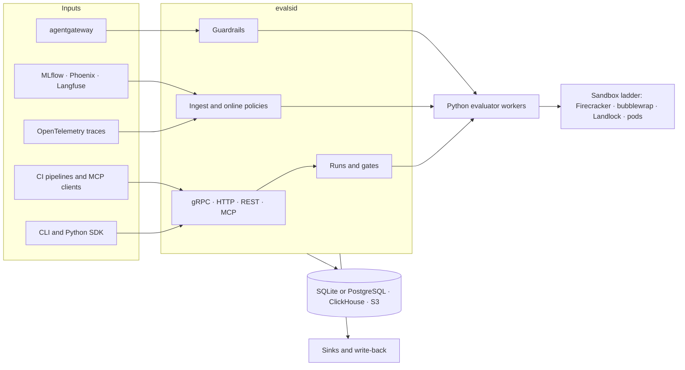

<div align="center">

# Evals.si

**One entrypoint to evaluate classic ML models, LLMs, RAG systems, agents and RL checkpoints, offline and online.**

Pluggable, sandboxed and self-hosted, from a laptop to Kubernetes.

[](https://github.com/Abhishek-Rnjn/Evals.si/actions/workflows/ci.yml)
[](https://abhishek-rnjn.github.io/Evals.si/)
[](LICENSE)


[Documentation](https://abhishek-rnjn.github.io/Evals.si/) ·
[Quickstart](#quickstart) ·
[Guides](#documentation) ·
[Examples](examples/) ·
[Roadmap](docs/LEFTOVERS.md)

</div>

---

Evals.si grades outputs you already have, runs a model or an agent on a dataset and gates on the result, and scores live agent traffic as it happens. The same evaluators work in every mode, so a metric means the same thing in CI, in production and in training.

## Highlights

- **Four ways in.** **Score** outputs you have, **Run** a target (model, RAG pipeline or agent) on a dataset with trials, gates and budgets, **Watch** live traces with online policies, and **Reward** RL training with the same evaluators.
- **Agents, offline and online.** Put the built-in agent, or your own over A2A, MCP, HTTP, an OpenAI Responses API or a CLI, to work on sandboxed tasks, including SWE-bench, τ-bench, Terminal-Bench and BFCL. Score production traces from LangGraph, CrewAI, the OpenAI Agents SDK, LlamaIndex and the Claude Agent SDK, each tested against recorded traces.
- **Works with your trace store.** Push OpenTelemetry (OTel GenAI, OpenInference, OpenLLMetry, MLflow), or let a trace source read MLflow, Phoenix or Langfuse, score the traces and write the scores back where your team already looks.
- **Pluggable.** lm-evaluation-harness, Inspect AI, RAGAS and DeepEval run as isolated adapters; your own evaluators are Python functions or sandboxed Wasm modules.
- **Honest numbers.** Every mean has a confidence interval. Records an evaluator can't judge are skipped, never scored as zero, and evaluator failures are errors. There is no default judge, so nothing is billed by surprise.
- **Fails closed.** Untrusted code runs in Firecracker microVMs where available, else bubblewrap or Landlock, else hardened pods, and never with weaker isolation than asked.
- **Runs in your environment.** A single binary, or Helm charts and an operator with CRDs. Self-hosted and air-gappable, with your own models, storage, identity and secrets.

## Quickstart

You need [uv](https://docs.astral.sh/uv/) (it installs Python 3.11+ for you). Running the server also needs [Go](https://go.dev/dl/) 1.26+. On Linux, the sandbox for code evaluators needs bubblewrap (see [Development](#development)).

```bash
git clone https://github.com/Abhishek-Rnjn/Evals.si && cd Evals.si
cd python && uv sync --all-packages
uv run evalsi eval --data ../examples/quickstart/qa.jsonl --evaluators exact-match,numeric-match,latency
```

```text
6 records · 3 evaluators

metric         n  mean     95% CI              skipped  errors
exact-match    6  0.333    [0.097, 0.700]            0       0
numeric-match  3  0.667    [0.208, 0.939]            3       0
latency        6  517.500  [276.409, 758.591]        0       0
```

Records that lack what an evaluator needs (here, a numeric reference) are **skipped**, never scored as zero. Failures in the evaluator or judge are reported as **errors** and excluded from the metrics. Use `--cluster-by <metadata key>` when records are correlated.

### Add a judge

There is no default judge. Configure one explicitly:

```bash
# Any OpenAI-compatible server: vLLM, Ollama, LiteLLM, an AI gateway, OpenAI itself
uv run evalsi eval --data ../examples/quickstart/qa.jsonl --evaluators exact-match,llm-judge \
  --judge-model my-judge --judge-base-url http://localhost:8000/v1

# Claude, through the official SDK (installed by the `anthropic` extra)
uv run evalsi eval --data ../examples/quickstart/qa.jsonl --evaluators llm-judge \
  --judge-provider anthropic --judge-model claude-opus-5-5 --param llm-judge.rubric=helpfulness
```

Judge responses are cached by content hash, so re-running an unchanged evaluation costs nothing. Pass `--no-cache` to force fresh calls.

### From Python

```python
import evalsi
from evalsi import Record, Score, evaluator

@evaluator(name="acme/polite", version="1.0.0")
def polite(record: Record) -> Score:
    return Score(passed="please" in record.output.as_text().lower())

result = evalsi.evaluate("qa.jsonl", ["exact-match", polite])
print(result.table())
result.save("results.json")   # manifest, summaries and every per-record result
```

`evalsi catalog` lists every installed evaluator and its params.

### As a server

`evalsid` serves the same evaluators over gRPC, gRPC-Web, HTTP/JSON and REST on one port, and runs the Python evaluators in a supervised worker.

```bash
go build -o bin/evalsid ./cmd/evalsid        # from the repository root
cd python && uv sync --all-packages
EVALSID=../bin/evalsid uv run evalsi serve --config ../examples/server/evalsi.yaml
```

```python
from evalsi.client import Client

with Client("http://localhost:8080") as client:          # API key from EVALSI_API_KEY
    print(client.evaluate("qa.jsonl", ["exact-match"]).table())
```

`Client.evaluate()` returns the same result as in-process `evalsi.evaluate()`, intervals included; `evaluate_async()` and `evaluate_stream()` (with `evalsi[grpc]`) don't block. REST lives under `/v1alpha1` (`POST /v1alpha1/evaluate`, `POST /v1alpha1/runs`, `GET /v1alpha1/traces/{trace_id}`, `GET /v1alpha1/scores` for online scores per trace and label, …; the full list is in `internal/server/rest.go`), and gRPC reflection is on.

On loopback with no `auth` section the server runs without authentication; on any other address it requires it unless you pass `--no-auth`. The example's judge is Claude: export `ANTHROPIC_API_KEY` first, or `llm-judge` reports errors (never zeros). To try API keys, roles and the audit log locally, use [`examples/auth/local.yaml`](examples/auth/local.yaml) and the [identity guide](docs/guides/identity.md).

## A tour

### Runs and CI gates

A run spec generates outputs from a target, scores them and checks gates. The same file runs embedded, on a server, or as a Kubernetes `EvalRun`:

```bash
uv run evalsi run -f ../examples/runs/capitals.yaml                               # embedded
uv run evalsi run -f ../examples/runs/capitals.yaml --server http://localhost:8080
uv run evalsi compare --server http://localhost:8080 <baseline-run> <candidate-run>
```

`trials: 3` adds pass@3 and pass^3, gates fail the command with exit code 3 (so CI fails), and budgets cap tokens. Server runs are durable: a run interrupted by a restart resumes without redoing finished work. A project can subscribe to signed [webhooks](docs/guides/webhooks.md) for finished runs and failed gates. See [`examples/ci`](examples/ci/) for a pull-request gate.

### Agent runs on sandboxed tasks

Each task gets its own environment: an OCI image, files, setup and a sandbox policy. The agent works in it, a checker grades the end state, and evaluators score the trajectory and the diff.

```bash
uv run evalsi run -f ../examples/agents/swebench-verified.yaml --server http://localhost:8080
uv run evalsi promote <run> --dataset regressions --when 'scores["task-success"] < 1' --server http://localhost:8080
```

`swebench://`, `taubench://`, `harbor://`, `terminal-bench://` and `bfcl://` datasets are graded by each benchmark's own code. The harness adds MCP tools, mocks and fault injection, a simulated user, and record and replay. See the [agent runs guide](docs/guides/agent-runs.md).

### Online evaluation of live agents

Send traces to the server's OTLP endpoint, or read them from where they already are, then apply a policy: a CEL selector, deterministic sampling, cascades (the judge runs only after cheap checks pass), windowed alerts, and promotion of bad traces into datasets.

```bash
uv run evalsi policy apply -f ../examples/watch/support-policy.yaml --server http://localhost:8080
uv run evalsi source apply -f ../examples/sources/studio-mlflow.yaml --server http://localhost:8080
```

| Framework | Tested instrumentations |
|---|---|
| LangGraph / LangChain | OpenInference, LangSmith's OTel export, MLflow autolog |
| CrewAI | MLflow autolog, OpenInference, OpenLLMetry |
| OpenAI Agents SDK | OpenInference, OpenLLMetry |
| LlamaIndex | OpenInference |
| Claude Agent SDK | OpenInference, Claude Code's own traces |

Each row is a real run of the framework, checked in and tested; the [agent frameworks guide](docs/guides/agent-frameworks.md) has the setup and what each instrumentation records. [Trace sources](docs/guides/trace-sources.md) read MLflow, Phoenix or Langfuse (history included), score the traces, and write the scores back as MLflow assessments, Phoenix annotations or Langfuse scores (Langfuse is built from its API spec and not yet run against a server). To add Evals.si to an agent platform, follow the [integration guide](docs/guides/integrate-an-agent-studio.md) and the [reference demos](examples/demo/README.md), which evaluate Deep Agents and DeepSeek Harness agents end to end.

### Evaluators and adapters

| Pack | Evaluators |
|---|---|
| `core` | exact, contains, fuzzy, numeric and regex match; JSON validity and schema; length; latency; token usage; cost |
| `judge` | `llm-judge` with rubrics |
| `text` | BLEU, corpus BLEU, ROUGE-1/2/L, chrF, token F1 |
| `rag` | faithfulness, answer relevance, context precision and recall, citation accuracy |
| `safety` | PII, secret and canary leaks; refusal; harmlessness |
| `agent` | tool-call accuracy, trajectory match, tool errors, loop detection, step budget, goal completion; task success (pass@k, pass^k), code quality, policy violations, efficiency |
| `code` | unit tests run in the sandbox, Python syntax |
| `rl` | verifiers for RL rewards: format, math answers, sandboxed code tests, overlong penalty, reward models |
| `finetune` | diversity, calibration, contamination, reward hacking |
| `ml-classic` | classification, regression and ranking metrics |
| `ml-monitoring` | drift (PSI, KS, Jensen-Shannon), data quality, group fairness |

DeepEval, RAGAS, Inspect AI and lm-evaluation-harness, and the SWE-bench, τ-bench and BFCL benchmarks, live in [`python/adapters`](python/adapters/README.md), each in its own pinned environment. Community evaluators can be [Wasm modules](docs/guides/plugins.md) with no filesystem, network or clock, installed from a plugin index.

### Kubernetes

```bash
kubectl create namespace evalsi
helm install evalsi-crds deploy/helm/evalsi-crds --set operator.namespace=evalsi
helm install evalsi deploy/helm/evalsi -n evalsi
kubectl apply -n evalsi -f examples/runs/capitals.yaml
kubectl get evalruns -n evalsi      # PHASE, RUN, DONE, TOTAL
```

An operator with `EvalRun`, `OnlineEvalPolicy`, `TraceSource`, `Evaluator` and `SandboxClass` resources, validated on admission. Also included:
- PostgreSQL, ClickHouse and S3 storage;
- NATS work queues with KEDA scaling;
- HA replicas, sandbox pools, service-account identity;
- an air-gapped bundle;
- a namespace-only install for clusters without cluster-admin.

See the [Kubernetes guide](docs/guides/kubernetes.md).

### And more

| | |
|---|---|
| [Identity and access](docs/guides/identity.md) | OIDC (Keycloak, Entra ID, Okta, …), API keys, GitHub Actions OIDC, client certificates; project RBAC with custom roles, CEL rules and an audit log |
| [Inline guardrails](docs/guides/guardrails.md) | Redact, evaluate and block LLM and MCP traffic in flight through agentgateway, with an audit mode |
| [MCP for coding agents](docs/guides/mcp.md) | `evalsi mcp` lets an agent run a suite before and after its change and see what regressed |
| [Human annotation](docs/guides/annotation.md) | Queues with rubrics, annotator agreement, and judge calibration against human labels |
| [Fine-tuning and RL](docs/guides/fine-tuning.md) | Evaluators as rewards for TRL, verl and OpenRLHF; every checkpoint checked against the base model |
| [Web UI](docs/guides/web-ui.md) | Runs, comparisons, policies, annotation queues, guardrails and the catalog, read through the API |
| Reports and analytics | `evalsi report` (HTML or Markdown), `evalsi analyze` (DuckDB over runs), sinks to MLflow, OpenTelemetry, Langfuse and Phoenix, a Grafana dashboard |

## Architecture



The Go server owns the API, runs, ingest, policies, auth and storage; evaluators run in Python workers (decision [0002](docs/decisions/README.md)). The protobuf API in `proto/` is the single source of truth for gRPC, REST and the CRDs. Read the [architecture and implementation plan](docs/DESIGN.md) and the [decision records](docs/decisions/README.md) for the why.

## Project status

The roadmap's phases 0 to 6 are built. The current work follows the [product requirements](docs/PRD.md) for running Evals.si as a service in customers' own clusters. Built so far:
- the remote client;
- webhooks;
- the reference demos;
- trace sources for MLflow and Phoenix (Langfuse from its API spec, not yet run against a server);
- tested profiles for the five first-cut agent frameworks.

The Kubernetes form factor is tested on kind in CI and was verified on AKS and an Istio ambient cluster with KVM nodes (the [verification report](docs/verification/README.md)). No release has been tagged yet. [LEFTOVERS](docs/LEFTOVERS.md) lists what is deferred or not yet verified.

## Documentation

| Start here | Guides | Reference |
|---|---|---|
| [Documentation site](https://abhishek-rnjn.github.io/Evals.si/) | [Agent runs](docs/guides/agent-runs.md) · [Agent frameworks](docs/guides/agent-frameworks.md) · [Trace sources](docs/guides/trace-sources.md) | [Architecture](docs/DESIGN.md) |
| [End-to-end guide](docs/guides/end-to-end.md) | [Kubernetes](docs/guides/kubernetes.md) · [agentgateway on Kubernetes](docs/guides/agentgateway-kubernetes.md) · [Identity](docs/guides/identity.md) | [Decision records](docs/decisions/README.md) |
| [Examples](examples/) | [Guardrails](docs/guides/guardrails.md) · [MCP](docs/guides/mcp.md) · [Plugins](docs/guides/plugins.md) · [Webhooks](docs/guides/webhooks.md) | [Product requirements](docs/PRD.md) |
| [Integrate an agent studio](docs/guides/integrate-an-agent-studio.md) | [Annotation](docs/guides/annotation.md) · [Fine-tuning and RL](docs/guides/fine-tuning.md) · [Web UI](docs/guides/web-ui.md) | [Roadmap and leftovers](docs/LEFTOVERS.md) |

## Repository layout

| Path | What |
|------|------|
| `proto/` | Protobuf API, the single source of truth (`evalsi.v1alpha1`, `evalsi.plugin.v1alpha1`) |
| `gen/go/` | Generated Go code (do not edit; run `make proto`) |
| `cmd/evalsid/`, `internal/` | The Go server: API and REST routes, auth, runs, rewards, OTLP ingest and framework profiles, online policies, trace sources, sandbox, sinks, statistics |
| `python/evalsi/` | Python SDK, CLI, embedded runner, evaluator worker, built-in packs, rewards (`evalsi.rewards`) and checkpoint evaluation (`evalsi.training`) |
| `python/evalsi-harness/` | The agent harness: tool loop, agent connectors, environments and checkers, RL environments, Harbor and Terminal-Bench importers |
| `python/adapters/` | Framework and benchmark adapters, each in its own environment |
| `cmd/evalsi-guest/` | The init and agent inside Firecracker microVMs, and the agent in sandbox pods |
| `cmd/evalsi-operator/`, `operator/` | The Kubernetes operator: CRD types, controllers, admission webhooks |
| `deploy/` | Helm charts (`evalsi`, `evalsi-crds`, `evalsi-sandboxd`), the air-gapped bundle, the kind e2e |
| `tests/` | End-to-end and load tests (`e2e`), chart tests (`helm`), trainer tests (`trainers`), framework trace recorders (`frameworks`) |
| `examples/` | Runnable examples and the reference demos |
| `docs/` | Design, decision records, requirements, guides and the verification report |
| `website/` | The documentation site |

## Development

You need Go (1.26+), [buf](https://buf.build/docs/installation) and [uv](https://docs.astral.sh/uv/).

```bash
make tools   # protobuf plugins, at the versions CI uses
make proto   # lint, format and regenerate code after editing proto/
make check   # everything CI runs: gofmt, go vet/test, buf lint/format, ruff, mypy, pytest
make e2e     # evalsid against a real Python worker; EVALSI_E2E_IMAGES=1 adds tests that pull images
make adapters-check   # each framework adapter's contract tests, in its own environment
make operator-gen     # regenerate the CRDs and deepcopy code after editing operator/api
```

For the Kubernetes pieces:
- **Operator tests** run against a real API server and etcd (envtest). Install its binaries with `setup-envtest` and set `KUBEBUILDER_ASSETS`; without it, those tests skip.
- **Chart tests** (`tests/helm`) need `helm` on the `PATH`; without it, they skip.
- **The kind e2e** (`deploy/e2e/kind-e2e.sh`) needs Docker, kind, kubectl and helm. It builds the image, makes an air-gapped bundle and installs from it, as the CI `kubernetes` job does.
- **The load test:** `EVALSI_LOAD=1 go test -run TestLoad -timeout 30m ./tests/e2e/`. `EVALSI_LOAD_SPANS` and `EVALSI_LOAD_RUN_RECORDS` set its sizes, and `EVALSI_LOAD_CLICKHOUSE_URL` runs the trace half against ClickHouse.

The sandbox tests need bubblewrap and unprivileged user namespaces. On Ubuntu 24.04, also run `sudo sysctl kernel.apparmor_restrict_unprivileged_userns=0`.

## Contributing

Issues and pull requests are welcome. Before you push, run what CI runs (`make check`, and `make e2e` for server and worker changes), and never skip or weaken a test to get green. Keep the guides, the [PRD](docs/PRD.md)'s status cells and [LEFTOVERS](docs/LEFTOVERS.md) true when behaviour changes, and record significant design choices as [decision records](docs/decisions/README.md). [AGENTS.md](AGENTS.md) has the full conventions, and is where coding agents working on this repository should start.

## License

[Apache License 2.0](LICENSE).
