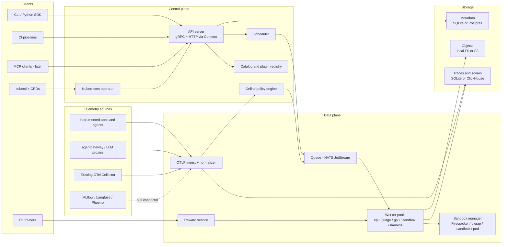
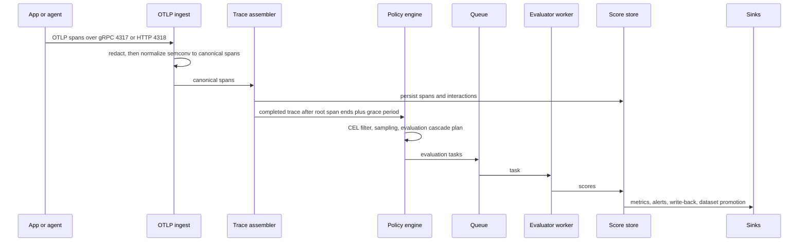
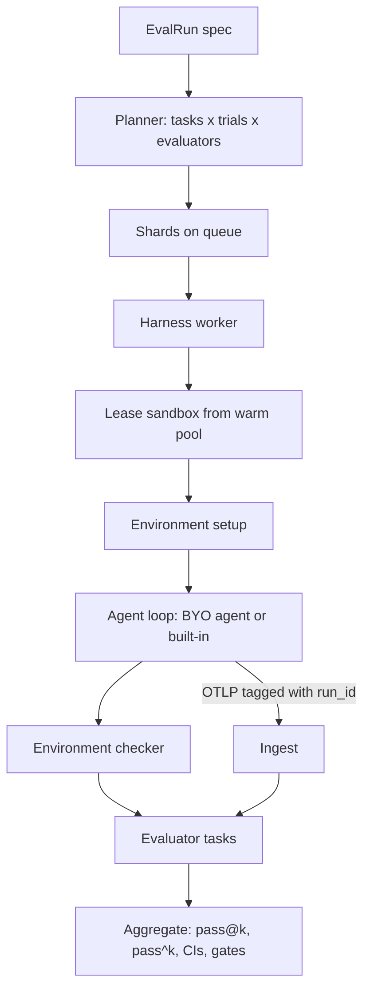
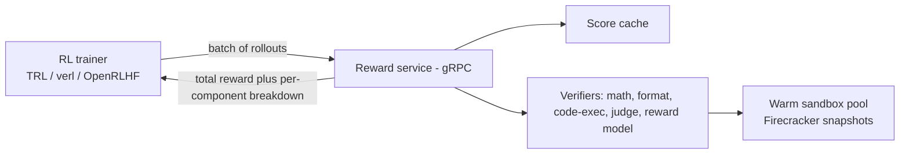

# Evals.si: Architecture & Implementation Plan

> **Status:** Draft for discussion · v0.6 · 2026-10-06. D1–D3, D5, D6, D10 and D13–D15 are decided (§22, [decision records](decisions/README.md)). Phases 0 to 5 are implemented (§23); MCP, classic ML and the ecosystem (Phase 6) are next.
>
> **Scope:** System design for a pluggable, scalable, single-entrypoint evaluation platform for classic ML models, LLMs and agents. It runs standalone and on Kubernetes, speaks gRPC and HTTP, and can later be used as a local MCP server.
>
> Section 22 records the decisions made so far and the ones still open. Everything else is a proposal to argue with.

---

## Table of contents

1. [TL;DR](#1-tldr)
2. [Goals and non-goals](#2-goals-and-non-goals)
3. [Personas and use cases](#3-personas-and-use-cases)
4. [Design tenets](#4-design-tenets)
5. [Core concepts and data model](#5-core-concepts-and-data-model)
6. [Architecture overview](#6-architecture-overview)
7. [The single-door API (gRPC + HTTP, later MCP)](#7-the-single-door-api-grpc--http-later-mcp)
8. [Plugin system and framework adapters](#8-plugin-system-and-framework-adapters)
9. [Built-in evaluator catalog (opt-in packs)](#9-built-in-evaluator-catalog-opt-in-packs)
10. [Trace collection and ingestion (OTLP)](#10-trace-collection-and-ingestion-otlp)
11. [Agent evaluation: offline, online and harnesses](#11-agent-evaluation-offline-online-and-harnesses)
12. [LLM fine-tuning and RL evaluation](#12-llm-fine-tuning-and-rl-evaluation)
13. [Sandboxing (Firecracker, bubblewrap, hardened pods)](#13-sandboxing-firecracker-bubblewrap-hardened-pods)
14. [Execution engine and scalability](#14-execution-engine-and-scalability)
15. [Storage](#15-storage)
16. [Deployment form factors](#16-deployment-form-factors)
17. [Security, identity and tenancy](#17-security-identity-and-tenancy)
18. [Reproducibility and versioning](#18-reproducibility-and-versioning)
19. [Developer experience](#19-developer-experience)
20. [Technology choices](#20-technology-choices)
21. [Repository layout](#21-repository-layout)
22. [Decisions](#22-decisions)
23. [Roadmap](#23-roadmap)
24. [Risks and mitigations](#24-risks-and-mitigations)
25. [Appendix: example specs](#25-appendix-example-specs)

---

## 1. TL;DR

- **One API with three ways in.** **Score** means you bring the outputs and we only grade them. **Run** means we execute a target (model, LLM, agent, checkpoint) on a dataset and grade it. **Watch** means we grade live traces continuously. All three share one evaluator layer, one result schema and one store.
- **Everything is a trace.** Offline agent runs emit OTLP the same way production traffic does. Offline and online evaluation therefore use the same evaluators, the same trace viewer and the same data model.
- **Adapt existing frameworks rather than rewriting them.** lm-evaluation-harness, Inspect AI, RAGAS, DeepEval, HELM, SWE-bench, τ-bench and others plug in as adapters. Each adapter runs in its own isolated environment, so their dependencies never conflict.
- **A Go core with a Python runtime.** Go handles the API (gRPC and HTTP from one handler via ConnectRPC), scheduling, OTLP ingestion, sandbox management and the Kubernetes operator. Python handles evaluators, adapters, the harness and the SDK, because that is where the eval ecosystem lives.
- **The same spec runs from laptop to cluster.** There are three tiers: an embedded library, a single binary (`evalsi serve`), and a Kubernetes operator with CRDs. The protobuf definitions are the single source of truth for the API, YAML specs, CRDs and (later) MCP tool schemas.
- **The strongest isolation available, failing closed.** Firecracker microVMs where KVM exists, otherwise bubblewrap or Landlock process confinement (adapted from the deepseek-harness sandbox), otherwise a hardened Kubernetes pod. Each evaluator or harness sets the minimum level it accepts.
- **Runs in the client's environment.** It is self-hosted and air-gappable, with bring-your-own models, storage, identity and secrets. A hosted multi-tenant offering comes later.
- **RL and fine-tuning reuse the evaluators.** Evaluators double as reward functions behind a high-throughput Reward Service. A checkpoint watcher turns every saved checkpoint into an eval run.

## 2. Goals and non-goals

### Goals

| # | Goal |
|---|------|
| G1 | **One entrypoint** for evaluating classic ML models, LLMs, RAG systems, agents and training checkpoints. |
| G2 | **Pluggable** with existing and future eval frameworks, model providers, trace backends, sandboxes and sinks, without forking the core. |
| G3 | **Two production form factors**: a standalone single binary and Kubernetes (operator plus CRDs), deployed in the style of agentgateway.dev. |
| G4 | **Both gRPC and HTTP/JSON** on every API, generated from one schema. **MCP** server mode later. |
| G5 | **Agent evals, offline and online**, with either a bring-your-own harness or a light built-in open-source harness that executes real agents. |
| G6 | **Traditional evals ship by default** and each project opts in to the ones it wants. |
| G7 | **Trace collection** through a native OTLP endpoint, or through an existing OTLP pipeline or backend the user already runs (MLflow, Langfuse, Phoenix and so on). |
| G8 | **Fine-tuning and RL evaluation**: reward/verifier services, checkpoint evaluation, and FT/RL-specific metrics. |
| G9 | **Sandboxing** that always uses the strongest isolation available (Firecracker, then bubblewrap or Landlock, then a hardened pod) and fails closed. |
| G10 | **Horizontal scalability**: millions of evaluation tasks per run, continuous online evaluation, and RL-grade reward throughput. |
| G11 | **Runs inside the client's environment**: self-hosted, air-gappable, least-privilege install, no phone-home. |

### Non-goals (for now)

- **Training models.** We evaluate and score. Trainers stay external (TRL, verl, OpenRLHF and others).
- **Replacing observability backends.** We store what we need to evaluate, and we write scores back to the user's backend.
- **A full model-serving platform.** We spin up ephemeral serving (vLLM/SGLang) only to evaluate checkpoints.
- **A heavyweight web UI in v1.** CLI, reports, Grafana and write-back to existing UIs come first (see [§22](#22-decisions)).
- **Redistributing benchmark datasets.** We fetch them at runtime from their sources and respect their licenses.
- **A hosted, multi-tenant service (for now).** Evals.si runs in the client's environment. The data model keeps room for multi-tenancy later (D5).

## 3. Personas and use cases

**Primary users for v1 (D1):** agent builders, agent platform builders and LLM app developers. The other personas are supported by the same design but are not what the early phases optimize for.

| Persona | Typical job | Mode | Priority |
|---------|-------------|------|----------|
| **Agent builder** | Measure the task success and reliability (pass^k) of a tool-using agent across 500 tasks in sandboxes, then monitor production | Run, Watch | **Primary** |
| **Agent platform builder** | Make evaluation a built-in capability of their agent platform: online policies at the gateway across many agents, a project per team, and eval results feeding rollout gates and routing | All, API-first | **Primary** |
| **LLM app developer** | Gate a prompt change in CI on correctness, faithfulness and cost | Score, Run | **Primary** |
| Research / RL engineer | Use sandboxed code-execution rewards in GRPO and track capability and regressions across checkpoints | Reward, Run | Phase 5 |
| ML engineer (classic ML) | Validate a churn model before promotion, then monitor drift and fairness | Run, Watch | Later |
| Coding agent | Call `evaluate` through local MCP to check its own work | Score | Later (Phase 6) |

## 4. Design tenets

1. **One schema, many surfaces.** Protobuf definitions generate the gRPC and HTTP APIs, OpenAPI, the JSON Schema for YAML specs, the CRD schemas, the Python and Go types, and later the MCP tool schemas.
2. **Three ways in, one evaluator layer.** Score, Run and Watch are only different ways of producing `Record`s. Evaluators never know which path a record came from.
3. **Everything is a trace.** Agent and LLM executions are normalized into one trajectory model that is built from OpenTelemetry spans.
4. **Adapt first, rewrite second.** Reimplement a metric only when the adapted version is too slow, too heavy or wrong.
5. **The same spec from laptop to cluster.** An `EvalRun` YAML works unchanged in the embedded library, the standalone binary and the Kubernetes operator.
6. **Isolation is a dial, not a default tax.** Pure-Python metrics run in-process. Untrusted code runs in a microVM.
7. **Available by default, active by choice.** Every built-in evaluator pack ships in the distribution. Projects opt in.
8. **Statistics are part of the product.** Every aggregate carries a confidence interval, sample count and variance across trials.
9. **Reproducible by construction.** Every run records the exact versions, image digests, prompt hashes, seeds and dataset hashes it used.
10. **Runs in the client's ecosystem.** Every dependency (models, storage, identity, secrets, observability) is bring-your-own, and nothing calls home.

## 5. Core concepts and data model

### Glossary

| Concept | Meaning |
|---------|---------|
| **Target** (system under test) | What is evaluated: an ML model endpoint or artifact, an LLM endpoint, an agent, a training checkpoint, or nothing at all (the outputs or traces already exist). |
| **Connector** | How we call a target: OpenAI-compatible, Anthropic, Bedrock, Vertex, vLLM/TGI/SGLang, Open Inference Protocol v2 (KServe/Triton/MLServer), MLflow pyfunc, A2A, MCP, plain HTTP/gRPC, CLI-in-sandbox, or a Python callable. |
| **Dataset** | A versioned collection of samples (input, optional reference, metadata). Sources include JSONL, Parquet, the Hugging Face Hub, MLflow datasets, trace queries and synthetic generation. |
| **Record** | The unit an evaluator sees: input, output, reference, context, trajectory, usage and metadata. |
| **Evaluator** | A function from records to scores. It can be deterministic, model-graded (a judge), programmatic (it executes code), statistical, or human. |
| **Judge** | A first-class model config used by model-graded evaluators: provider, model, parameters, and a versioned prompt template. |
| **Suite** | A reusable bundle of dataset, evaluators, parameters and gates. Benchmarks such as MMLU or SWE-bench are suites. |
| **Harness** | The thing that drives an agent through a task inside an environment and produces a trajectory. |
| **Environment** | The world an agent acts in: sandbox image, setup, tools, user simulator, and a checker. |
| **Run** | One offline execution of target × suite × trials, producing records and scores. |
| **Policy** (online) | Continuous evaluation of live traces: filter, sample, evaluate, aggregate and alert. |
| **Sink** | Where results go: our own store, MLflow, Langfuse, W&B, OTel, Prometheus, S3 or a webhook. |
| **Gate** | A CEL condition over aggregates that passes or fails a run, for example to gate CI or a deployment. |

### Evaluator scopes

Evaluators declare the scope they work at. Getting this right early prevents a rewrite later, because corpus-level metrics such as AUC or corpus BLEU cannot be computed one sample at a time.

| Scope | Input | Examples |
|-------|-------|----------|
| `span` | One normalized span | Retrieval relevance of one retriever call, or the validity of one tool call |
| `record` | One input/output pair, optionally with its trajectory | Exact match, faithfulness, toxicity, task success |
| `session` | A multi-turn conversation (`session.id` / `gen_ai.conversation.id`) | Goal completion across turns, user frustration |
| `dataset` | All records, computed map → reduce | ROC-AUC, macro-F1, corpus BLEU, calibration (ECE), drift (PSI), pass@k |
| `comparative` | Two or more runs | Pairwise preference, paired significance, regressions |

### Canonical records

The authoritative definitions live in [`proto/evalsi/v1alpha1`](../proto/evalsi/v1alpha1): `record.proto` (records, content, trajectories, usage, provenance and isolation reports), `score.proto` (scores, outcomes, results and summaries), `evaluator.proto` (references, manifests, requirements) and `evaluation_service.proto`. An abridged view:

```protobuf
package evalsi.v1alpha1;

// The unit every evaluator consumes, whichever way it arrived (Score / Run / Watch).
message Record {
  string id = 1;
  Content input = 2;
  Content output = 3;
  Content reference = 4;               // optional ground truth; a JSON list means "any of these"
  repeated Content context = 5;        // e.g. retrieved documents
  Trajectory trajectory = 6;           // optional; agents and multi-step chains
  Usage usage = 7;                     // tokens, cost, latency of producing the output
  map<string, google.protobuf.Value> metadata = 8;  // slices, tags, labels
  Provenance provenance = 9;           // run or trace origin, plus the sandbox isolation report
}

message Content {
  oneof kind {
    string text = 1;
    Messages messages = 2;             // chat format, including tool calls
    google.protobuf.Value json = 3;
    TabularRow row = 4;                // classic ML: features, prediction, probabilities
    Tensor tensor = 5;
    MediaRef media = 6;                // image, audio or video by URI
  }
}

message Score {
  string name = 1;                     // metric name inside the evaluator
  oneof value {
    double number = 2;
    bool passed = 3;
    string label = 4;
    google.protobuf.Value structured = 5;
  }
  string explanation = 6;
  optional double confidence = 7;
  Usage cost = 8;                      // e.g. judge tokens
  map<string, google.protobuf.Value> metadata = 9;
}

// One evaluator on one record. Only OUTCOME_SCORED counts toward metrics.
message EvaluationResult {
  string record_id = 1;
  string evaluator = 2;                // instance name or alias
  string evaluator_ref = 3;            // "builtin/exact-match@1.0.0"
  Outcome outcome = 4;                 // SCORED | SKIPPED | ERROR | CANCELLED
  repeated Score scores = 5;
  string reason = 6;
  google.protobuf.Duration duration = 7;
}
```

## 6. Architecture overview



### Components

| Component | Lang | Responsibility | Scales by |
|-----------|------|----------------|-----------|
| **API server** | Go | ConnectRPC handlers (gRPC, gRPC-Web, HTTP/JSON, REST transcoding), authentication, validation, run lifecycle | Stateless replicas |
| **Catalog** | Go | Registry of evaluators, suites, adapters, judges and connectors. Resolves `ref`s to versioned manifests. | With the API |
| **Scheduler** | Go | Plans runs into shards and tasks, enforces budgets and rate limits, handles retries and resume | Leader-elected, with sharded planning |
| **Online policy engine** | Go | CEL filters, sampling, evaluation cascades, windowed aggregation, alerts, dataset promotion | Partitioned by project |
| **OTLP ingest** | Go | OTLP gRPC on 4317 and HTTP on 4318, semantic-convention normalization, trace assembly, redaction | Stateless replicas, partitioned by trace ID |
| **Queue** | NATS | Work and result streams. Embedded in standalone mode, a cluster on Kubernetes. | NATS cluster |
| **Workers** | Python | Plugin host: load evaluators and adapters, call targets and judges, batch, emit results | Pools autoscaled on queue lag |
| **Harness workers** | Python | Drive agents through tasks and lease sandboxes | Pool, autoscaled |
| **Sandbox manager** (`sandboxd`) | Go | Picks the isolation rung, runs microVM pools and snapshots, bubblewrap and Landlock confinement, and sandbox pods; manages leases and network policy | Per node (DaemonSet on KVM nodes) and sandbox-pool pods |
| **Reward service** | Go + Python | Low-latency batch scoring for RL. Caches results and fans out to verifiers. | Replicas plus sandbox pools |
| **Result writer** | Go | Batched, idempotent writes of scores and records to the store; fan-out to sinks | Replicas |
| **Operator** | Go | Reconciles CRDs into the same objects the API creates | Leader-elected |

**Why split Go and Python?** Every eval framework worth adapting is Python. The parts that must be fast, long-lived and Kubernetes-native (ingest at tens of thousands of spans per second, a scheduler, VM lifecycle, an operator) benefit from Go's static binaries, concurrency, the OpenTelemetry Collector libraries (`pdata`), controller-runtime and the Firecracker Go SDK. The two halves talk only over protobuf (gRPC and NATS), so either half can be swapped. [§22](#22-decisions) lists the alternatives.

## 7. The single-door API (gRPC + HTTP, later MCP)

### One schema, every protocol

- Protobuf in `proto/evalsi/v1alpha1`, managed with `buf`. CI runs lint and format checks and verifies the generated code is current. Breaking-change checks start once `v1` exists.
- **ConnectRPC** serves **gRPC, gRPC-Web and Connect (HTTP/1.1 + JSON)** from one handler. **Vanguard** adds REST-style routes from `google.api.http` annotations (`POST /v1/evaluate`, `GET /v1/runs/{id}`).
- An OpenAPI document is generated for HTTP-only consumers. Python and Go clients are generated, then wrapped by hand-written ergonomic SDKs.
- OTLP endpoints use their standard ports and protocol: gRPC on 4317 and HTTP on 4318.

### Services

```protobuf
service EvaluationService {          // Mode 1: Score. You bring records, we grade them.
  rpc Evaluate(EvaluateRequest) returns (EvaluateResponse);               // sync, small batches
  rpc EvaluateStream(stream EvaluateRequest) returns (stream EvaluateResponse);
}
service RunService {                 // Mode 2: Run. We execute the target, then grade.
  rpc CreateRun(CreateRunRequest) returns (Run);
  rpc GetRun(GetRunRequest) returns (Run);
  rpc ListRuns(ListRunsRequest) returns (ListRunsResponse);
  rpc WatchRun(WatchRunRequest) returns (stream RunEvent);               // progress, partial scores
  rpc CancelRun(CancelRunRequest) returns (Run);
  rpc ResumeRun(ResumeRunRequest) returns (Run);                         // skip completed tasks
  rpc CompareRuns(CompareRunsRequest) returns (Comparison);              // paired stats, regressions
}
service MonitorService {             // Mode 3: Watch. Policies over live traces.
  rpc ApplyPolicy(ApplyPolicyRequest) returns (Policy);
  rpc ListPolicies(ListPoliciesRequest) returns (ListPoliciesResponse);
  rpc GetPolicyStats(GetPolicyStatsRequest) returns (PolicyStats);
}
service CatalogService  { /* list and describe evaluators, suites, adapters, judges, connectors; install plugins */ }
service DatasetService  { /* create, version, append, import from HF/MLflow, promote traces into a dataset */ }
service TraceService    { /* query interactions, sessions and spans with their scores */ }
service RewardService   { /* hot path for RL: batched streaming scoring (§12) */ }
service AuthService     { /* who-am-i, API keys, custom roles, role bindings, audit log (§17, Phase 2) */ }
```

### What "single door" looks like

```bash
# HTTP: score two records with a deterministic metric and an LLM judge
curl -s localhost:8080/v1/evaluate -d '{
  "records": [
    {"input": {"text": "Capital of France?"}, "output": {"text": "Paris"}, "reference": {"text": "Paris"}},
    {"input": {"text": "2+2?"},               "output": {"text": "5"},     "reference": {"text": "4"}}
  ],
  "evaluators": [
    {"ref": "builtin/exact-match"},
    {"ref": "builtin/llm-judge", "params": {"rubric": "correctness", "judge": "default"}}
  ]
}'
```

```python
import evalsi

# Embedded: no server, runs in-process. Good for notebooks and CI.
res = evalsi.evaluate(data="qa.jsonl", evaluators=["builtin/exact-match", "ragas/faithfulness"])
print(res.table())  # n, mean and 95% CI for each metric

# Against a server (Phase 1): the same spec, executed at scale
client = evalsi.Client("grpc://evalsi.internal:8080")
run = client.runs.create("run.yaml")
for event in run.watch():
    print(event)
```

### MCP (later, but cheap to add)

Because the API is generated from protobuf, `evalsi mcp` can expose MCP tools with schemas generated from the same messages, over stdio for local use and streamable HTTP for remote use. Candidate tools are `evaluate`, `list_evaluators`, `run_suite`, `get_run`, `compare_runs`, `query_traces` and `promote_to_dataset`. Run reports become MCP resources. This lets coding agents evaluate their own output locally.

## 8. Plugin system and framework adapters

### Extension points

| Kind | Interface | Examples |
|------|-----------|----------|
| `evaluator` | `Describe`, `Evaluate` (batched), `Reduce` (dataset scope) | exact-match, G-Eval, RAGAS faithfulness, unit-test runner |
| `adapter` | Exposes an external framework's suites and metrics as our suites and evaluators | lm-eval-harness, Inspect AI, DeepEval, HELM |
| `connector` | `Invoke` a target or judge model; capabilities such as streaming, tools and logprobs | OpenAI-compatible, Anthropic, OIP v2, A2A, MCP, CLI |
| `harness` | `Setup`, `Run`, `Check`, `Teardown` (§11) | built-in harness, SWE-bench, τ-bench, BYO |
| `dataset-source` | Read, version and stream samples | JSONL, Parquet, HF Hub, MLflow, trace query |
| `trace-source` | Pull traces with a watermark, and write scores back | MLflow, Langfuse, Phoenix, LangSmith, Tempo, ClickHouse |
| `semconv-mapper` | Map vendor span attributes onto the canonical trajectory | OTel GenAI, OpenInference, OpenLLMetry, MLflow |
| `sink` | Export records, scores and aggregates | MLflow, W&B, OTel, Prometheus, S3/Parquet, webhook |
| `sandbox-driver` | Create, exec, copy, snapshot, restore, destroy (§13) | Firecracker, bubblewrap, Landlock, hardened pod; optional gVisor, Kata, Docker, E2B |
| `notifier` | Deliver alerts | Slack, PagerDuty, webhook |

### Plugin runtimes: one protocol, four ways to run it

| Runtime | When | Isolation | Overhead |
|---------|------|-----------|----------|
| **In-process Python** (entry points such as `evalsi.evaluators`) | Built-ins and light, trusted plugins | None | Lowest |
| **Subprocess** with its own `uv` virtualenv, speaking gRPC over a Unix socket | Plugins whose dependencies conflict (for example `torch` pins) | Process | Low |
| **Remote service** (container or Kubernetes Deployment) speaking gRPC | Heavy or GPU plugins, other languages (Node, Rust, Go), vendor services | Container or VM | Network hop |
| **HTTP webhook** | SaaS evaluators, quick integrations | External | Network hop |
| *WebAssembly (later)* | Small untrusted deterministic evaluators | Wasm | Low |

All of them speak the same protocol, so the host does not care which runtime a plugin uses:

```protobuf
package evalsi.plugin.v1alpha1;

// Plugins also implement the standard gRPC health protocol (grpc.health.v1.Health).
service EvaluatorPluginService {
  rpc Describe(DescribeRequest) returns (DescribeResponse);   // the evaluators this plugin hosts
  // Bidirectional streaming: the host pipelines batches and the plugin batches internally (GPU, judges).
  rpc Evaluate(stream EvaluateRequest) returns (stream EvaluateResponse);
  // Dataset-scope metrics, computed over all records at once.
  rpc Reduce(ReduceRequest) returns (ReduceResponse);
}
```

### Plugin manifest

```yaml
# evalsi-plugin.yaml
name: ragas/faithfulness
version: 0.3.1
kind: evaluator
scope: record
modalities: [text]
requires:
  input: true
  output: true
  context: true          # retrieved documents
  reference: false
  trajectory: false
  judge: true            # uses the run's configured judge; never hard-codes a provider
  isolation: none        # minimum level: none | confined | namespaced | kernel | vm
outputs:
  - {name: faithfulness, type: number, range: [0, 1], higherIsBetter: true}
runtime:
  python: {package: "evalsi-adapter-ragas==0.3.1", entrypoint: "evalsi_ragas:Faithfulness"}
  # or: image: ghcr.io/evals-si/adapter-ragas:0.3.1@sha256:...
scheduling: {pool: judge, batchable: true, maxBatch: 32}
```

The scheduler routes each task to a worker pool from `requires` and `scheduling`. Records that do not satisfy `requires` (for example a missing `context`) are reported as `skipped(reason)`, never silently counted as zero.

### Writing an evaluator

```python
from evalsi import evaluator, Record, Score
import json

@evaluator(name="acme/json-valid", version="1.0.0", scope="record")
def json_valid(record: Record) -> Score:
    try:
        json.loads(record.output.text)
        return Score(passed=True)
    except json.JSONDecodeError as e:
        return Score(passed=False, explanation=str(e))
```

### Framework adapters

| Framework | What we import | Integration path |
|-----------|----------------|------------------|
| **lm-evaluation-harness** | Tasks become suites, along with their metrics | Adapter registers an `LM` subclass that routes generation through our connectors, so rate limits, caching and cost accounting apply. Runs in its own image because of heavy dependencies. |
| **Inspect AI** (+ `inspect_evals`) | Tasks, solvers and scorers become suites, harnesses and evaluators | Run Inspect tasks natively, provide an Evals.si **sandbox provider for Inspect** so its tasks use our sandboxes, and import Inspect logs as records. |
| **HELM, lighteval, OpenAI simple-evals, BigCode harness** | Scenarios and benchmarks | Wrapped runners whose results map onto records and scores |
| **RAGAS, DeepEval, TruLens, Phoenix evals, Opik, MLflow GenAI scorers** | Metrics become evaluators | In-process adapters. Judge calls route through our judge config, so they are cached, rate-limited and costed. |
| **promptfoo** | Assertions and red-team plugins | Node subprocess or container |
| **SWE-bench, τ-bench, Terminal-Bench / Harbor, BFCL, GAIA, WebArena / BrowserGym** | Tasks, environments and checkers | Harness adapters running inside our sandboxes (§11) |
| **scikit-learn metrics, Evidently, Fairlearn** | Classic ML metrics, drift and fairness | In-process |
| **TRL, verl, OpenRLHF, NeMo-RL** | Reward-function interfaces and trainer callbacks | Reward client plus callbacks (§12) |

**Reverse adapters.** We also expose Evals.si evaluators *to* other frameworks: as MLflow scorers, Inspect scorers, DeepEval metrics and TRL reward functions. Being pluggable in both directions makes adoption incremental: teams keep their framework and gain our evaluators, sandboxes and storage.

**Adapter maturity tiers.** *Native* means we own the implementation and it is fully tested. *Wrapped* means a thin shim over the upstream package. *Community* means published by third parties to a plugin index. The catalog shows the tier and pins upstream versions.

## 9. Built-in evaluator catalog (opt-in packs)

Every pack ships in the default distribution and images. Naming an evaluator explicitly (in `evaluate()`, a run spec or on the command line) is itself the opt-in. A project additionally enables packs in its config, for example `evaluators.packs: [core, judge, rag, agent]`, which decides what online policies may run and what the project's catalog shows. Only `core` is on by default. A platform admin can restrict a project to an allowlist of packs (Phase 1, with the server). Packs with heavy dependencies (BERTScore, local classifiers) are pulled lazily as separate plugin images.

| Pack | Contents | Default |
|------|----------|---------|
| `core` | Exact and fuzzy match, contains, regex, JSON and JSON-Schema validity, length, latency, tokens and cost | **on** |
| `ml-classic` | Accuracy, precision, recall and F1 (micro and macro), ROC-AUC, PR-AUC, log-loss, calibration (ECE, Brier), confusion matrix; MAE, MSE, RMSE, R², MAPE; NDCG, MRR, MAP, recall@k | opt-in |
| `ml-monitoring` | Drift (PSI, KS, JS divergence), data quality, fairness (demographic parity, equalized odds) | opt-in |
| `text` | BLEU, ROUGE, chrF, METEOR, BERTScore, embedding similarity, perplexity | opt-in |
| `judge` | Rubric scoring, G-Eval style, pairwise preference, reference-guided correctness, custom prompt judges | opt-in |
| `rag` | Faithfulness and groundedness, answer relevance, context precision and recall, citation accuracy | opt-in |
| `safety` | Toxicity, PII leakage, prompt-injection and jailbreak success, refusal correctness, bias probes | opt-in |
| `agent` | Task success, tool-call accuracy, trajectory match, step efficiency, loop detection, budget adherence, pass@k and pass^k | opt-in |
| `code` | Sandboxed unit-test execution, compile and lint checks, pass@k | opt-in |
| `benchmarks` | MMLU(-Pro), GSM8K, MATH, GPQA, HumanEval, MBPP, IFEval, ARC, HellaSwag, MT-Bench and more, via adapters | opt-in |
| `rl` | Verifiable rewards (math equivalence, code execution, format), reward-hacking diagnostics (§12) | opt-in |

**Judges get evaluated too.** Every judge evaluator can be calibrated against a human-labeled set. We report agreement (accuracy, Cohen's κ) and position or length bias, and warn when a run uses an uncalibrated judge for a gate.

## 10. Trace collection and ingestion (OTLP)

The underlying question is how to get the outputs and trajectories we need to evaluate without asking teams to re-instrument. The answer is to accept data along every common path and normalize it into one model.

### Five ways traces reach us

| Path | How | Best for |
|------|-----|----------|
| **A. Native OTLP endpoint** | Apps export OTLP straight to `evalsi-ingest` (gRPC on 4317, HTTP on 4318) using any OTel GenAI instrumentation (OpenLLMetry/Traceloop, OpenInference, OpenLIT, Logfire, vendor SDKs) | New setups and the standalone form factor |
| **B. Tee from an existing collector** | Add one more `otlp` exporter pipeline to the user's OTel Collector. No app changes. | Teams that already run collectors |
| **C. Bring your own backend (pull and write-back)** | `trace-source` connectors poll MLflow Tracing, Langfuse, Phoenix, LangSmith, Tempo/Jaeger or ClickHouse with a watermark, then write scores back (for example as MLflow assessments or Langfuse scores) | Teams that want scores in the UI they already use |
| **D. Gateway capture** | agentgateway, LiteLLM, Envoy AI Gateway and similar emit traces for all LLM, MCP and A2A traffic | Zero-code coverage of a whole platform |
| **E. SDK direct log** | `evalsi.log(input=..., output=..., trace_id=...)` for apps without OTel | Legacy and batch jobs |

We also ship **`evalsi-collector`**, an OpenTelemetry Collector distribution built with the Collector Builder (OCB). It bundles an `evalsi` exporter plus GenAI-aware processors for redaction, sampling and attribute normalization, for teams that want sampling or PII scrubbing *before* data leaves their cluster.

### Ingest pipeline



### Normalization: semantic-convention mappers

Instrumentations disagree on attribute names, and some conventions (OTel GenAI in particular) are still evolving. Mappers are versioned plugins that translate them into the canonical `Trajectory`.

| Canonical field | OTel GenAI semconv | OpenInference |
|-----------------|--------------------|---------------|
| Step type | `gen_ai.operation.name` (`chat`, `execute_tool`, `invoke_agent`, …) | `openinference.span.kind` (`LLM`, `TOOL`, `AGENT`, `RETRIEVER`, …) |
| Model | `gen_ai.request.model` / `gen_ai.response.model` | `llm.model_name` |
| Tokens | `gen_ai.usage.input_tokens` / `gen_ai.usage.output_tokens` | `llm.token_count.prompt` / `llm.token_count.completion` |
| Tool | `gen_ai.tool.name` | `tool.name` |
| Session | `gen_ai.conversation.id` | `session.id` |

Mappers for MLflow, OpenLLMetry and Logfire follow the same pattern. Unknown spans are kept as `generic` steps with their raw attributes, so nothing is dropped.

**Content capture caveat.** Many GenAI instrumentations do not record prompt and response content unless it is enabled explicitly (content capture is opt-in for privacy). Without content, only structural and performance evaluators can run. The docs and the policy engine must say so loudly: a policy whose evaluators need `output` reports `skipped: no content` rather than producing misleading scores.

### Trace assembly and late signals

- Spans arrive out of order and across services. The assembler buffers by `trace_id` until the root span ends plus a configurable grace period, the same approach as the Collector's tail-sampling `decision_wait`. It is partitioned by trace ID, so it scales horizontally.
- **Late signals** such as user thumbs-up or thumbs-down, a ticket resolved two days later, or human labels join to the trace or session ID and can trigger *delayed* evaluators. This is how online evals get ground truth.
- Scores are emitted back into OTel as GenAI evaluation events (`gen_ai.evaluation.result`, where the semconv version in use supports it) and as metrics. Dashboards built on the user's existing observability stack light up without extra work.

### Privacy

Redaction runs at the edge (`evalsi-collector`) or at ingest, using regex rules and an optional Presidio plugin. Retention TTLs are set per project. Each policy can restrict which attributes its evaluators may see, and judges never receive fields the policy has redacted.

## 11. Agent evaluation: offline, online and harnesses

### Bring your own agent, harness, or neither

| | **Built-in harness** | **Bring your own harness** |
|---|---|---|
| **Bring your own agent** | You provide an agent endpoint (A2A, MCP, OpenAI Responses-compatible, HTTP) or a CLI to run in the sandbox (for example a coding agent). We provide the environment, tools, user simulator, budgets, recording and grading. | You already have the full loop (an internal harness, Inspect tasks, SWE-bench scripts). We orchestrate, sandbox, collect traces and score. |
| **Built-in reference agent** | Our light tool-calling agent runs against any OpenAI-compatible model. Use this to compare *models* in agentic settings. | n/a |

### Harness protocol (for BYO harnesses)

```protobuf
service Harness {
  rpc Describe(DescribeRequest) returns (HarnessManifest);        // task formats, environment needs
  rpc Setup(SetupRequest) returns (EnvironmentHandle);            // may lease an Evals.si sandbox
  rpc Run(RunRequest) returns (stream TrajectoryEvent);           // drives the agent, streams steps (also exported as OTLP)
  rpc Check(CheckRequest) returns (CheckResult);                  // environment-side grading: tests, DB state, files
  rpc Teardown(TeardownRequest) returns (TeardownResponse);
}
```

A BYO harness can be a Python class, a container image that implements the gRPC service, or an existing framework wrapped by an adapter.

### `evalsi-harness`: the light built-in harness

The built-in harness is open source, small and dependency-light. It provides:

- **Agent loop**: a tool-calling loop over any OpenAI-compatible or Anthropic model, with MCP tool servers, parallel tool calls, and step, token, cost and wall-clock budgets.
- **Environments**: an image or Dockerfile, a setup script, tools (MCP servers or functions), and a checker script. The task format is designed to import Terminal-Bench/Harbor, Inspect and SWE-bench tasks.
- **User simulator**: an LLM-driven simulated user with a persona and goal, for multi-turn tasks in the style of τ-bench.
- **Tool virtualization**: mocked or recorded tools for hermetic offline runs, plus fault injection (timeouts, errors, malformed results) for robustness testing.
- **Record and replay**: every model call and tool I/O is captured to a cassette. Replay lets you re-score with new evaluators without re-running the agent, debug runs deterministically, and branch from step *N* for counterfactual evaluation.
- **OTel by default**: every step becomes a span tagged with `evalsi.run_id`, `evalsi.trial` and `evalsi.task_id`, so offline runs appear in the same trace views as production.
- **Sandbox policy events**: sandbox denials and escalation requests (§13) are recorded as trajectory events. With no human in the loop, the harness policy decides whether an escalation is allowed (deny by default), and safety evaluators can score how often an agent tried to step outside its permissions.

### Offline run flow



### Trajectory evaluators (`agent` pack)

- **Outcome:** task success from the environment checker, goal completion judged by an LLM, final-answer correctness.
- **Process:** tool-selection accuracy, argument correctness, trajectory match against a reference (strict, unordered, subset or superset), redundant or looping calls, recovery after tool errors, handoff correctness in multi-agent systems.
- **Efficiency:** steps, tokens, cost, latency, and how much of each budget was used.
- **Safety:** dangerous or irreversible actions, policy violations, data exfiltration attempts (sandbox egress logs are evidence), and prompt-injection susceptibility in tool results.
- **Reliability:** pass@k (succeeds at least once in *k* tries) and **pass^k** (succeeds in *all k* tries, as in τ-bench). The second matters more for production agents.

### Online agent evals

An `OnlineEvalPolicy` combines the following pieces (see the example in the [Appendix](#25-appendix-example-specs)):

- **Selector.** A CEL expression over resource, span and gateway attributes. It is the same expression language agentgateway and Kubernetes use.
- **Sampling.** A base rate plus *always-evaluate* rules: errors, negative feedback, latency outliers, new agent versions.
- **Evaluation cascade.** Cheap deterministic checks run first, then a small classifier, then an LLM judge only when needed. This keeps judge spend bounded.
- **Windows, aggregates and alerts.** Results become Prometheus metrics, webhooks or Slack messages.
- **Flywheel.** Failing or interesting traces are *promoted into a dataset* and become offline regression cases. **Shadow replay** then re-runs those production inputs against a candidate agent version and compares it with the current one, before rollout.

## 12. LLM fine-tuning and RL evaluation

### Evaluators as rewards: the Reward Service

During RL, every rollout needs a score, often from untrusted code execution, at high throughput and low latency. The same evaluator plugins serve this, behind a dedicated hot path:



- **Composite reward specs.** Rewards are weighted sums of components with gates (for example, the format check must pass before anything else counts). Every response returns a *per-component breakdown*, which is essential for spotting reward hacking.
- **Verifier library.** Symbolic math equivalence (in the spirit of `math-verify`), sandboxed code execution against tests, schema and format checks, LLM-judge or generative reward models, and served reward models (batched on GPU workers).
- **Drop-in for trainers.** `evalsi.rewards.load("reward.yaml")` returns a callable that matches TRL's `reward_funcs` signature and verl's `compute_score` signature, either in-process or as a thin client to the Reward Service.
- **Throughput design.** Batching, content-hash caching of (prompt, completion, spec) results, pre-warmed microVM pools restored from snapshots, and back-pressure to the trainer. For a sense of scale, a GRPO step with 512 prompts and 8 samples each needs 4,096 sandboxed executions. With 256 concurrent warm microVMs and about 1 second per test run, that is roughly 16 seconds per step. The pool and snapshot design exists to keep that number low. On hosts without KVM, the bubblewrap rung gives the same throughput with millisecond startup at the `namespaced` isolation level.
- **Environments double as RL environments.** A harness environment (§11) can be exposed with a gym-style `reset` / `step` interface. We will evaluate compatibility with emerging environment specs (OpenEnv and verifiers-style environments) so one task definition serves both evaluation and training.

### Checkpoint evaluation loop

1. **Trigger:** a trainer callback (Hugging Face `TrainerCallback.on_save`, Lightning, verl hooks) or a watcher on an S3 prefix, the MLflow Model Registry or the Hugging Face Hub.
2. **Serve:** the operator brings up ephemeral vLLM or SGLang for the checkpoint. LoRA adapters are hot-loaded into a shared base-model server instead of starting a new server for each checkpoint.
3. **Evaluate:** run the configured suites. Results are keyed by `(training_run, step)`.
4. **Report:** learning curves, comparison with the base model, regression gates, and optional early-stop signals back to the trainer.

### Fine-tuning and RL-specific evaluations

| Concern | What we measure |
|---------|-----------------|
| Target-task gain | Suite scores against the base model and the previous checkpoint, with paired significance tests |
| Catastrophic forgetting | General-capability suites (knowledge, reasoning, instruction following) against the base model |
| Contamination | N-gram or embedding overlap between training data and eval sets, plus membership-inference signals (for example Min-K% Prob) |
| Reward hacking | Divergence between the training reward and a held-out judge, length bias, per-component reward drift, KL to the reference policy |
| Diversity and mode collapse | Distinct-n, self-BLEU, output entropy |
| Calibration | ECE and Brier score on held-out multiple-choice sets |
| Safety regression | Refusal correctness, jailbreak success rate, toxicity, against the base model |
| Sampling behavior | pass@k curves, and sensitivity to temperature and seed |

## 13. Sandboxing (Firecracker, bubblewrap, hardened pods)

### Interface

```text
Create(spec) -> handle      Exec(handle, cmd, stdin, timeout) -> stream(stdout, stderr) + Outcome
CopyIn / CopyOut            Snapshot(handle) -> snapshot_id      Restore(snapshot_id) -> handle
Destroy(handle)             Stats(handle) -> cpu, mem, net, egress log

Outcome = exit(code) | denied(effect) | runner_failure(signature) | timeout
Isolation = {driver, level, enforcement: full | partial}   // reported on every Create and Exec
```

The `spec` covers the image (an OCI reference), the file-access mode, resources (CPU, memory, PIDs, disk), a wall-clock timeout, the network mode (`deny` by default, or `allowlist`), mounts, environment variables, and the minimum isolation level.

Isolation levels are ordered `vm` > `kernel` > `namespaced` > `confined` > `none`:

- `vm`: a separate guest kernel (Firecracker, Kata).
- `kernel`: a user-space kernel (gVisor).
- `namespaced`: separate mount, PID and network namespaces plus seccomp and resource limits (bubblewrap, a hardened pod).
- `confined`: same-world, with kernel-enforced file and TCP rules (Landlock).

### The isolation ladder (decided, D6)

Evals.si always uses the **strongest rung available** where it runs, then checks it against the request's `minIsolation`. If no available rung satisfies it, the sandbox fails closed with `SANDBOX_UNAVAILABLE`. **It never silently runs unconfined.**

| Form factor | Ladder, strongest first |
|-------------|-------------------------|
| Standalone (`evalsi serve`, embedded) | **Firecracker** (if `/dev/kvm` is usable) → **bubblewrap** (static binary we ship) → **Landlock** → fail closed |
| Kubernetes | **Firecracker** via `sandboxd` on KVM nodes → **bubblewrap** inside sandbox-pool pods (in a pod user namespace, or privileged where nodes lack them) → **hardened pod** per sandbox → fail closed |

| Driver | Level | Startup | Requires | Notes |
|--------|-------|---------|----------|-------|
| `firecracker` | `vm` | ~125 ms boot; faster from a warm snapshot | `/dev/kvm` (bare metal or nested virtualization) | The default whenever KVM exists |
| `bwrap` | `namespaced` | milliseconds | Unprivileged user namespaces | Statically linked binary in our release; profile below |
| `landlock` | `confined` | milliseconds | Linux ≥ 5.13 with Landlock enabled; ABI ≥ 4 (Linux 6.7) to also restrict TCP | Weaker than bwrap: no separate mount or PID view. Reports `partial` enforcement on older ABIs. |
| `pod` | `namespaced`; `kernel` with a gVisor RuntimeClass; `vm` with Kata | Seconds (image pull and pod start) | Kubernetes | Used when rungs 1 and 2 are unavailable in-cluster; no snapshots |

Further drivers can be added to a ladder through `SandboxClass`: `gvisor`, `kata`, `docker`/`containerd` (a local development convenience) and `remote` (E2B, Modal, Daytona). None of them are in the default ladder.

Because the bwrap and Landlock rungs start in milliseconds, hosts without KVM still get high-throughput sandboxed execution. That matters for RL rewards and code evaluators (§12).

### What we adopt from the deepseek-harness process sandbox

The [deepseek-harness sandbox](https://github.com/deepseek-ai/deepseek-harness/blob/master/packages/sandbox/sandbox/README.md) (MIT, TypeScript) confines subprocesses with bubblewrap, then Landlock on Linux. We port its **design** to Go in `internal/sandbox` and keep attribution for anything derived from its code:

- **Fail closed.** `confine` either returns an enforcing command or errors with `SANDBOX_UNAVAILABLE`. Unconfined passthrough is impossible unless a spec explicitly asks for `none`.
- **Policy rides the call.** The file-access mode (`read-only`, `workspace-write`, `full-access`) is set per call, not per provider, so two tasks on one worker can run under different policies.
- **Enforcement is a reported fact.** Each execution reports `full` or `partial` enforcement, for example Landlock on an older kernel ABI. We record it in every record's provenance and in the run manifest, and gates can require `enforcement == full`.
- **Functional probes.** Each candidate runner is probed once by running the real profile against `true`, and the verdict is cached for the process lifetime. An installed binary is not taken as proof that it works.
- **Separate failure dialects.** Each runner's denial signatures and runner-failure signatures are classified separately. A broken sandbox is then never confused with a command the policy denied, which is essential for scoring (§14).
- **Escalation vocabulary.** A denied call can request a strictly wider mode. Evals have no human in the loop, so the harness policy decides (deny by default), and every request becomes a trajectory event that safety evaluators can score (§11).

### Where we harden it for untrusted eval workloads

The deepseek-harness profile was built to confine a coding assistant on its user's own machine. It binds the host root read-only and governs file writes only (`--ro-bind / /`, private PID namespace, writable workspace). Running untrusted, model-generated code needs more:

| Concern | deepseek-harness profile | Evals.si profile |
|---------|--------------------------|------------------|
| Root filesystem | Host `/`, read-only | An unpacked OCI image (cached by digest) as `/`, so host files are invisible. Host-root mode is only for trusted evaluators. |
| Reads | Unconfined | Limited to the image root, the workspace and explicit mounts (Landlock read rules on rung 3) |
| Environment and secrets | Inherited | `--clearenv` plus explicit variables; secret paths are never bound; sandbox hosts hold no provider keys (§17) |
| Network | Not governed | `--unshare-net` by default (loopback only); Landlock ABI ≥ 4 denies TCP bind and connect; allowlisted egress only on the Firecracker and pod rungs, through a logging egress proxy |
| Processes | Private PID namespace | `--unshare-all`, `--new-session` and `--die-with-parent` |
| Syscalls | Not filtered | A seccomp-BPF filter loaded via `--seccomp` |
| Resources | None | cgroup v2 limits (CPU, memory, PIDs) where delegated, rlimits otherwise, plus a wall-clock timeout and output size caps |

Implementation notes:

- **Static bubblewrap.** The release builds bubblewrap statically (`scripts/build-static-bwrap.sh`) and ships it beside evalsid, which prefers it over the host's, so the rung does not depend on a distro package. bubblewrap is LGPL-2.0-or-later, so it ships as a separate executable with its license and a source reference.
- **cgroup limits.** With a delegated cgroup v2 directory (`sandbox.cgroup`: by default evalsid's own cgroup, when it is writable and holds no other process, as under a systemd unit with `Delegate=yes`), each execution of the bubblewrap and Landlock rungs starts directly in its own child cgroup (`CLONE_INTO_CGROUP`). The child sets `memory.max` (no swap, the whole group killed on OOM), `pids.max` and, optionally, `cpu.max`. When the execution ends, `cgroup.kill` stops anything it left running, including processes that started a new session. memory.events reports an out-of-memory kill as a denial. rlimits stay as the per-process bound; without a cgroup they are the only one, and the isolation report says so.
- **Landlock from Go.** The Landlock rung uses `go-landlock`. A Landlock ruleset applies to the calling process and is inherited across `execve`, so `evalsi` re-executes itself as a small launcher (`evalsi sandbox-exec`) that applies the ruleset and then executes the target command.
- **User namespaces.** These can be disabled or restricted on some distributions (Ubuntu's AppArmor restriction, for example), and default container seccomp and AppArmor profiles usually block them inside pods. The functional probe detects this. On Kubernetes, sandbox-pool pods can use a `Localhost` seccomp profile that permits user-namespace creation. Otherwise the ladder falls through to the pod rung.

### Firecracker driver design

- **Root filesystems from OCI images.** OCI images are converted into ext4 root filesystems (`mkfs.ext4 -d`) and cached by digest. Each VM gets its own copy (reflinked where the filesystem supports it); devmapper thin snapshots remain an option for large pools.
- **Guest agent.** A small static Go binary inside the VM speaks over **vsock** and handles exec, streaming stdio, file transfer and health. The guest has no SSH and no network unless the policy allows it.
- **Jailer.** The VMM can run under the Firecracker jailer (chroot, cgroups, seccomp, dropped privileges). It is optional, because it needs root, and it is recommended in production.
- **Networking.** VMs have no network device ([decision 0011](decisions/0011-agent-environments-and-benchmarks.md)). When a policy allows egress, the guest reaches the host-side egress proxy over vsock. The proxy logs every connection, and those logs become evidence for safety evaluators. Without tap devices or nftables, the rung needs no root, and egress policy is one mechanism on every rung.
- **Snapshots and warm pools.** We boot once, run the environment setup (dependency installs, repo checkout) and snapshot. Clones are then restored on demand. After a restore, the guest agent's `Refresh` reseeds guest entropy and sets the clock, so clones do not share RNG state.
- **Hardware.** KVM requires bare-metal or nested-virtualization-capable instances. The `sandboxd` DaemonSet runs only on nodes labeled as KVM-capable.

### Hardened pod rung (Kubernetes)

When neither Firecracker nor bubblewrap is available in the cluster, each sandbox is a dedicated pod, created through the Kubernetes API by a sandbox pool (a `SandboxClass` with `ladder: [pod]`). As built in Phase 4:

- **The task's image, with our agent injected:** an init container copies `evalsi-guest` from the Evals.si image into an `emptyDir`, and the guest becomes the container's command. Commands, files and limits go through it over the pod network (gRPC behind a per-sandbox bearer token), as they do over vsock in a microVM; never `kubectl exec`.
- **No credentials or host access:** `automountServiceAccountToken: false`, `enableServiceLinks: false`, no host paths and no Secrets mounted.
- **Hardened context:** `allowPrivilegeEscalation: false`, the `RuntimeDefault` seccomp profile, and all capabilities dropped except the few package installs need (`CHOWN`, `DAC_OVERRIDE`, `FOWNER`, `FSETID`, `KILL`, `SETGID`, `SETUID`; configurable, `[]` keeps none). It runs as the image's user unless `runAsUser` is set; set a non-zero one where Pod Security `restricted` applies.
- **Network:** the `evalsi-sandboxes` NetworkPolicy admits traffic to sandbox pods only from their pool and lets them reach only the pool, which relays allowed egress through its logging egress proxy. A pod that ignores the proxy still reaches nothing else.
- **Limits:** CPU and memory limits from the `SandboxClass` and the sandbox spec; the guest enforces timeouts and output caps.
- **Stronger runtimes when available:** `runtimeClassName` (with its `level`) comes from the `SandboxClass` when the cluster offers gVisor or Kata, which raises the rung's level.
- **No warm pools or snapshots:** environment setup runs once per trial. [kubernetes-sigs/agent-sandbox](https://github.com/kubernetes-sigs/agent-sandbox) (a Sandbox CRD with warm pools) remains the candidate if pod start latency matters.

### Configuring the ladder

Standalone, the ladder is the `sandbox:` section of `evalsi.yaml`. On Kubernetes, each `SandboxClass` is a sandbox pool the operator runs, with its own ladder:

```yaml
apiVersion: evals.si/v1alpha1
kind: SandboxClass
metadata: {name: default}
spec:
  ladder: [bwrap, landlock]              # tried in order; the first usable rung that meets minIsolation wins
  minIsolation: namespaced
  replicas: 2
  maxSandboxes: 8                        # per replica
  podSecurity: userns                    # or privileged, for nodes without user namespaces
---
apiVersion: evals.si/v1alpha1
kind: SandboxClass
metadata: {name: pods}
spec:
  ladder: [pod]
  pod:
    defaultImage: python:3.13-slim
    runtimeClassName: gvisor             # optional; with level: kernel, raises the rung's level
    level: kernel
    networkPolicyEnforced: true
```

The operator writes each pool's address into `status.address`, and a worker pool's `sandbox.address` points at it. Network policy, resources and timeouts stay in each task's sandbox policy. The cluster-wide `evalsi-sandboxd` chart provides the same pool as a DaemonSet or Deployment, including the Firecracker mode on KVM nodes.

## 14. Execution engine and scalability

### Work decomposition

```text
Run ─► Shards (ranges of samples) ─► Tasks
        Task = (sample, trial, stage)   stage ∈ {generate | harness, evaluate[evaluator], reduce}
```

- **Idempotency.** Each task has a deterministic key `(run_id, sample_id, trial, stage, evaluator@version)`, and results are upserted. Retries, duplicate deliveries and `ResumeRun` therefore never double-count. After a crash, a resumed run skips completed tasks.
- **Infrastructure failures are not model failures.** Every task ends as `scored`, `skipped(reason)`, `infra_error(kind)` or `cancelled`. Sandbox unavailability, sandbox runner failures, provider 5xx errors and crashes in our own machinery are `infra_error`: they are retried, reported separately and excluded from metrics instead of being counted as failures. A sandbox *denial* is different. It is the agent's own behavior, so it stays in the trajectory and counts.
- **Pipelining.** Evaluation of sample *i* starts as soon as its generation finishes. There is no global barrier except for `dataset`-scope reducers.
- **Routing.** Tasks go to NATS subjects per pool (`work.<pool>`). Workers use pull consumers, and KEDA autoscales each pool on consumer lag.

| Pool | Workload | Tuning |
|------|----------|--------|
| `cpu` | Deterministic metrics | High parallelism, small pods |
| `judge` | LLM-judge and provider-bound I/O | asyncio, high concurrency, central rate limits |
| `gpu` | BERTScore, classifiers, reward models, local judges | Batching, GPU node selectors |
| `sandbox` | Code execution | Sandbox leases, KVM nodes |
| `harness` | Long-running agent trials | Long timeouts, heartbeats, checkpointing |

### Cost, rate limits and caching

- **Central token buckets** per provider, model and API key (requests per minute and tokens per minute), shared across workers through the queue or KV store. 429 responses get adaptive backoff and a circuit breaker.
- **Judge cache.** Judge calls are cached by content hash of (judge model, parameters, prompt template hash, inputs). Re-running a suite after an unrelated change costs nothing for unchanged records.
- **Budgets.** Every run and policy has a cost ceiling and token ceiling. Projected cost is shown before a run starts (`evalsi run --dry-run`).

### Statistical rigor (built in, not bolted on)

- Every aggregate reports *n*, the mean and a 95% CI (bootstrap, or a Wilson interval for proportions). We use **clustered standard errors** when samples share a source (for example many questions from one document).
- `CompareRuns` uses paired tests (paired bootstrap, McNemar for binary outcomes) and flags differences below the minimum detectable effect.
- Multi-trial runs report variance across trials alongside pass@k and pass^k. Seeds are recorded and passed to connectors that support them.

### Initial scale targets

Phase 4's load test measured these; the results are in §23.

| Dimension | Target |
|-----------|--------|
| `Evaluate` server overhead, deterministic evaluator | p50 < 20 ms |
| OTLP ingest per replica | ≥ 20k spans/s (normalize, redact, write) |
| Online freshness, non-judge evaluators | p95 < 2 min from trace completion to stored score |
| Warm sandbox lease (Firecracker snapshot) | p95 < 250 ms; cold < 2 s |
| Run size | ≥ 1M evaluation tasks per run; resumable |
| Concurrent agent trials (cluster) | 10k+, bounded by node capacity |

## 15. Storage

| Data | Standalone | Kubernetes / scale | Notes |
|------|------------|--------------------|-------|
| Metadata (projects, runs, specs, plugins, datasets, policies, judges, keys) | SQLite | PostgreSQL | Small and relational |
| Spans, interactions, records, scores | SQLite (DuckDB deferred, [decision 0009](decisions/0009-standalone-sqlite-in-process-scheduler.md)) | Run results in PostgreSQL; traces and online scores in ClickHouse, or PostgreSQL without it | Columnar, high-volume, TTL; partitioned by project and day |
| Datasets, cassettes, artifacts, reports, root filesystems | Local filesystem | S3-compatible (S3, GCS, MinIO), conditional writes | Content-addressed |
| Work queues | In-process (decision 0009) | NATS JetStream (`work.<pool>`); large payloads through the object store | Kafka could be an option later |
| Leases (run ownership, the policy engine's leader) | One process, none needed | Database leases in PostgreSQL | A replica adopts a stopped replica's runs |

The storage layer sits behind repository interfaces, so a team can point us at their existing ClickHouse or Postgres. Every backend takes TLS with a private CA and client certificates. **Datasets** are content-addressed: a version is the hash of its records, and promoting traces creates a new version, never a mutation.

## 16. Deployment form factors

The model follows agentgateway: the same binary runs from a local config file or under a Kubernetes control plane. On Kubernetes, the **Helm chart renders the same `evalsi.yaml` the standalone binary reads**, and the operator is a client of the same API the CLI uses ([decision 0012](decisions/0012-kubernetes-operator-and-packaging.md)).

### Runs in the client's environment (decided, D5)

For now, every form factor is installed and operated by the client, inside their own infrastructure. A hosted offering comes later, when we have the compute for it.

- **Nothing calls home.** Product telemetry is off unless the operator turns it on.
- **Bring your own everything:**
  - models and judges, including private endpoints and AI gateways;
  - storage (Postgres, ClickHouse, S3-compatible);
  - identity (OIDC);
  - secrets (Kubernetes Secrets, Vault, cloud secret managers);
  - observability (their OTel Collector, Prometheus, Grafana).
- **Air-gapped installs.** An offline bundle (`deploy/airgap/bundle.sh`) contains every image the charts use, the charts, extra images such as the tasks' sandbox images, and optionally the CLI's Python wheels; `install.sh` loads it into the client's registry and installs. A mirror tool that copies benchmark datasets into the client's object store, respecting each dataset's license, is not built yet.
- **Least-privilege install.** The main Helm install is namespace-scoped. Cluster-scoped pieces (CRDs, the optional `sandboxd` DaemonSet, its node labels) are separate charts, because on many clusters a platform team owns those. The operator's ClusterRoleBinding is opt-in. A namespace admin can install the main chart alone, under Pod Security `restricted`, with the chart's own sandbox pool and the API in place of the CRDs ([guide](guides/kubernetes.md#installing-without-cluster-admin)).
- **Single tenant per install, with projects inside it.** Every project-scoped row carries `project_id` and a reserved `tenant_id` column (empty in a single-tenant install; SQLite, PostgreSQL and ClickHouse), so a hosted multi-tenant offering can fill it in rather than reshape stored data.

### Tier 0: Embedded library (`pip install evalsi`)

This tier runs evaluators, adapters and the built-in harness in-process with an asyncio scheduler. There is no server or queue, and it stores to DuckDB or JSON files. It is meant for notebooks, unit tests and small CI jobs. It runs the same `EvalRun` YAML.

### Tier 1: Standalone (`evalsi serve`)

```bash
evalsi serve --config evalsi.yaml          # starts the Go daemon, evalsid
#  :8080  API (gRPC + gRPC-Web + HTTP/JSON)
#  :4317  OTLP gRPC     :4318  OTLP HTTP
#  in-process scheduler, SQLite, local datasets dir (decision 0009)
#  supervises Python worker processes (uv-managed venvs per adapter)
#  sandbox ladder probed at startup: firecracker if /dev/kvm is usable, else static bwrap, else Landlock, else fail closed
```

The tier ships as a single static Go binary plus the Python worker, and as one container image (the root `Dockerfile`, which Kubernetes uses too). The same `storage` section that Kubernetes uses points a single node at Postgres, ClickHouse and S3 for heavier use; a `docker compose` profile for that is not built yet.

### Tier 2: Kubernetes (Helm + operator)

As built in Phase 4 (see the [Kubernetes guide](guides/kubernetes.md)):

| Workload | Kind | Chart |
|----------|------|-------|
| `evalsi`: `evalsid serve` replicas serving the API and OTLP ingest | Deployment; leases in PostgreSQL decide which replica schedules each run and which runs the policy engine | `evalsi` |
| `evalsi-worker-<pool>` (`cpu`, `judge`, `sandbox`, `harness`, optionally `gpu`): `evalsid worker` driving a local Python worker | Deployments, optionally scaled by KEDA on their JetStream consumer's backlog | `evalsi` |
| `evalsi-operator` | Deployment, leader-elected; also serves the admission webhooks | `evalsi` (webhook configuration and CRDs in `evalsi-crds`) |
| NATS JetStream | StatefulSet, or bring your own | `evalsi` |
| PostgreSQL, ClickHouse, S3-compatible storage | Bring your own (`devPostgres` starts a throwaway PostgreSQL for trying replicas out) | — |
| `evalsi-sandboxd` | DaemonSet: bubblewrap in a user namespace, bubblewrap privileged, or Firecracker on KVM nodes; holds no secrets | `evalsi-sandboxd` |
| `evalsi-sandbox-<name>` | A sandbox pool per `SandboxClass`, run by the operator (bubblewrap, Landlock, Firecracker or the pod rung) | — |
| Sandbox pods | One hardened pod per sandbox, created on demand by a pod-rung pool | — |
| Your evaluator plugins | An `Evaluator` resource: the operator runs its image as a worker Deployment for the pools it names | — |

The plan's separate API, ingest, result-writer, scheduler and policy-engine Deployments became one `evalsid serve` Deployment with leases (§23).

**CRDs** (API group `evals.si/v1alpha1`). The first four are implemented; the rest stay inline fields until they are needed:

| CRD | Purpose |
|-----|---------|
| `EvalRun` ✅ | One offline execution (target × suite × trials); its `spec` is a run file |
| `Evaluator` ✅ | Runs a plugin image as worker pools, optionally KEDA-scaled |
| `OnlineEvalPolicy` ✅ | Selector, sampling, evaluators, alerts and promotion over live traces; its `spec` is a policy file |
| `SandboxClass` ✅ | Cluster-scoped, like StorageClass: a sandbox pool with its isolation ladder, minimum level and rung settings (§13) |
| `EvalSchedule` | Cron-triggered runs (nightly regressions) |
| `EvalSuite`, `Dataset`, `Judge`, `EvalTarget`, `Harness` | Reusable named building blocks |

`EvalTarget` can reference a Kubernetes `Service`, a KServe `InferenceService`, an agent endpoint behind the gateway, or a checkpoint URI (which triggers ephemeral serving).

### Working with agentgateway

- **Traces:** point agentgateway's OpenTelemetry tracing exporter at the `evalsi` Service on port 4317 (see the [agentgateway-on-Kubernetes guide](guides/agentgateway-kubernetes.md)), or fan out from an existing collector. Every LLM, MCP and A2A call through the gateway can then be evaluated with zero app changes.
- **Policies:** `OnlineEvalPolicy` selectors match on gateway route, backend, MCP tool or A2A agent attributes using CEL, the same expression language agentgateway uses. *The exact attribute names need to be validated against agentgateway's emitted spans.*
- **Same two form factors:** agentgateway standalone with `evalsi serve` on a developer box, or both on Kubernetes.
- **Identity:**
  - Both use the same OIDC providers and the same tokens: agentgateway forwards a validated JWT with `preserveToken`, and `evalsid` validates it again against the same issuer.
  - Authorization rules use the same CEL vocabulary and the same `allow`, `deny` and `require` semantics in both (§17).
  - The `ingest` role and an API key bound to one project let the gateway's trace exporter write traces without broader access.
- **Later:** feed scores back into the gateway (quality-aware routing, auto-disabling a misbehaving MCP tool) and an inline guardrail mode through the gateway's external-processing hooks. Both depend on which extension points agentgateway exposes, and that needs validating.

## 17. Security, identity and tenancy

Identity and access is Phase 2 of the roadmap (§23, [decision 0010](decisions/0010-identity-and-access-next.md)). The model follows agentgateway, so a team that already runs agentgateway uses the same identity provider, the same tokens and the same policy language for both.

### Why it comes next

Today `evalsid` authenticates nobody. Its only protection is the default `127.0.0.1` listen address. Anyone who can reach a non-loopback server can:

- **spend money:** start runs and evaluations that call targets and judges with the server's provider keys;
- **read sensitive data:** traces and run results, which hold prompts, outputs and often PII;
- **run code:** code evaluators execute submitted programs in the sandbox;
- **change what is measured:** apply or delete online policies, and inject traces into any project.

Platform builders run Evals.si as a shared service ([decision 0008](decisions/0008-platform-builders-use-a-service.md)), so a shared server needs identity now. Phase 3 adds agents with MCP tools, sandbox leases and bring-your-own CLI agents, which widens all of the above. Project scoping is also cheapest to enforce now, while the store is small and every query is ours.

### Principles

- **Bring your own identity provider.** Evals.si keeps no user database or passwords. Any OIDC issuer works: Keycloak, Entra ID, Okta, Auth0, Google, Dex, Kubernetes service-account tokens, GitHub Actions.
- **agentgateway's model and vocabulary:**
  - authentication policies turn a credential into verified claims, with modes `strict`, `optional` and `permissive`;
  - authorization is CEL rules of three kinds, `allow`, `deny` and `require`, evaluated with the same precedence;
  - tokens are read from a configurable location;
  - API keys are stored as `sha256:` hashes;
  - external authorization is available for central policy engines.

  Our config keeps evalsi.yaml's snake_case, but every concept and name maps one to one.
- **Secure by default:**
  - On a non-loopback address, `evalsid` refuses to start without an `auth` section. Running unauthenticated takes an explicit `auth: {mode: none}`, `evalsid serve --no-auth` or `EVALSID_NO_AUTH=1` (for development and tests; the rest of the auth config stays in place, unenforced). Each logs a warning on every start.
  - With auth enabled, the default decision is deny.
- **One enforcement point.** A single authenticator and authorizer covers every surface: gRPC, gRPC-Web, Connect, the REST routes, OTLP ingest, `/metrics` and reflection. A new RPC cannot ship without an entry in the action table; a test walks the service descriptors to enforce this.
- **Roles shaped by the application.** Built-in roles cover the common cases. Clients define custom roles from the permission list, with optional CEL conditions, and can map roles straight from their identity provider's claims. Global CEL rules are only for install-wide restrictions.

### Authentication

| Method | For | Details |
|---|---|---|
| **JWT bearer (OIDC)** | Users, services, CI | One or more `providers`, each with an `issuer`, `audiences` and `jwks`. The JWKS comes from a `url`, a `file`, `inline` JSON, or OIDC discovery of the issuer. Options: `required_claims` (default `exp`), an algorithm allowlist (RS256, ES256 and EdDSA by default; `none` is never accepted), and clock skew. JWKS are cached and refreshed on an unknown `kid`, with rate limiting. The token location defaults to `Authorization: Bearer`; a custom header, cookie or query parameter can be set. |
| **API keys** | Collectors, scripts, long-running services | Keys carry an `evk_` prefix so secret scanners can find them. Only the SHA-256 hash is stored, either in config (`sha256:<hex>`) or in the database when created through the API, where the plaintext is shown once. Each key is bound to a principal name, project roles, an optional expiry and metadata. Last use is recorded. |
| **Mutual TLS** | Service meshes, Kubernetes components | An optional `client_ca`. A certificate's SPIFFE ID or subject becomes the principal. |
| **Behind agentgateway** | Gateway-fronted deployments | agentgateway validates the JWT and forwards it with `preserveToken`, and `evalsid` validates the same token again against the same issuer. Trusting identity headers from a proxy is supported only from configured source CIDRs, and is discouraged. |

Modes apply per method:

- `strict`: a valid credential is required.
- `optional`: a credential is validated if present. Anonymous requests then reach authorization as `principal.kind == "anonymous"`.
- `permissive`: claims are decoded for policy use, and invalid tokens are not rejected. Meant for migrations only.

**TLS.** The API listener can terminate TLS itself; certificate and key files are reloaded on change. With bearer tokens on a non-loopback address, plaintext needs `allow_plaintext: true`, which states that TLS terminates in front of `evalsid`.

**Token hygiene:**

- tokens and API keys are never logged, stored in manifests or passed to workers or sandboxes;
- `Authorization` headers are redacted everywhere;
- JWKS are fetched over HTTPS, except for an explicit `allow_insecure_jwks` meant for local development;
- token size is capped.

### Principals and claims

Every authenticated request carries a **principal**:

- `kind`: `user`, `service`, `apikey` or `anonymous`;
- `provider` and `subject`, which are unique together;
- `name`, `email` and `groups`;
- the raw `claims`;
- the roles the principal holds in each project.

Identity providers name things differently: Keycloak and Okta use `groups`, Entra ID uses `roles` or `groups`, and GitHub Actions puts the repository and ref in `sub`. Each provider therefore has a `claims` mapping for subject, name, email and groups.

Role bindings name principals as follows:

- `user:<provider>/<subject>`, or `email:<address>` when the provider asserts `email_verified`;
- `group:<provider>/<group>`;
- `key:<name>` for an API key;
- `cel:<expression>` for anything else, for example `cel:jwt.repository == "acme/agent" && jwt.ref == "refs/heads/main"`.

### Authorization: RBAC plus CEL rules

**Roles: built-in and custom.** Access is described in roles that fit each client's application, not in a fixed rule set.

- **Permissions** are the actions in the action table below (`runs.create`, `traces.read`, `policies.write` and so on). That list is a stable, versioned public contract. Wildcards such as `runs.*` and `*` are allowed.
- **A role** is a name, a list of permissions, and optionally:
  - `inherits`: other roles it extends;
  - `condition`: a CEL expression over the request and resource attributes that must hold for the role to grant anything.
- **Bindings** grant a role to principals in a project. `*` grants it in every project.

Evals.si ships these built-in roles. Clients can extend them, or ignore them and define their own:

| Built-in role | Permissions |
|---|---|
| `viewer` | `catalog.read`, `runs.read`, `policies.read`, `traces.read` |
| `runner` | `viewer`, plus `evaluations.run`, `runs.create`, `runs.cancel` and `runs.resume`. This spends judge and target budget and may execute code. |
| `editor` | `runner`, plus `policies.write`, which includes dataset promotion |
| `admin` | `editor`, plus `access.manage` (the project's API keys, custom roles and bindings) and `audit.read` |
| `ingest` | `traces.write` and nothing else. Meant for collectors and agentgateway. |
| `owner` (install-wide) | Everything, including install settings, every project and `metrics.read`. It cannot be redefined. |

**Custom roles.** A client describes access in its own terms:

```yaml
rbac:
  roles:
    - name: prompt-engineer
      inherits: [viewer]
      permissions: [evaluations.run, runs.create, runs.cancel]
      # Only these models, and only runs labeled for their app.
      condition: 'resource.target.model in ["qwen3", "claude-opus-5-5"] && resource.labels.app == "checkout"'
    - name: trace-auditor
      permissions: [traces.read, audit.read]
    - name: ci-gate
      permissions: [runs.create, runs.read]
      condition: '!resource.runs_code'
```

Custom roles can follow the client's application in three ways:

- **Roles from the token.** If the identity provider already puts application roles in the token, a provider's `role_claims` maps the claim values to Evals.si roles, per project or install-wide (for example `app_roles: checkout-lead` becomes `editor` in `checkout`). The application keeps owning role assignment, and Evals.si needs no separate bindings.
- **Labels on resources.** Runs, policies, traces and API keys carry labels such as `app: checkout`, `env: prod` or `team: payments`.
  - Traces get them from OTLP resource attributes `evalsi.label.<key>`, or from the ingest credential's labels.
  - Role conditions and rules read them as `resource.labels`, giving scoping finer than projects, in the application's own terms.
  - Callers can only attach labels that their own roles' conditions allow, so labels cannot be used to escape a condition.
- **Conditions.** A role can be limited to certain models, judges, evaluators, datasets, labels or code execution. Conditions are written in CEL, the language agentgateway's rules use.

Roles are defined in `evalsi.yaml`, or created through `AuthService` and stored in the database. `evalsi auth roles create|list|update|delete` manages them. A role is either install-wide (only an owner can create one) or belongs to one project.

**Guardrails on roles:**

- Unknown permission names, inheritance cycles and conditions that do not compile are rejected when the config or the API call is processed. A typo never silently grants nothing, or too much.
- **No privilege escalation.**
  - A principal with `access.manage` in a project can only create, change or bind roles whose permissions it holds itself there, with conditions at least as strict.
  - Install-wide permissions (install settings, other projects, `metrics.read`) are reserved for `owner` and cannot appear in a project role.
- Global `deny` and `require` rules apply on top of every role, so no custom role can get around them.
- Changing a role takes effect on the next request. Every change is written to the audit log, with the old and new definitions.
- `evalsid auth check` names the role, binding and condition behind each decision.

**Action table.** Every RPC maps to one action, which is also the permission roles grant, and a set of resource attributes. Every action also gets `resource.labels`.

| RPC or endpoint | Action | Lowest role | Resource attributes for CEL |
|---|---|---|---|
| `EvaluationService.Evaluate`, `EvaluateStream` | `evaluations.run` | runner | project, evaluators, judge, whether any evaluator runs code |
| `CatalogService.ListEvaluators` | `catalog.read` | viewer | none |
| `RunService.CreateRun` | `runs.create` | runner | project, target (connector, model), judge, evaluators, dataset (path or URI), trials, budget |
| `GetRun`, `ListRuns`, `WatchRun`, `ListRunResults`, `CompareRuns` | `runs.read` | viewer | project, run (id, name, `created_by`, labels) |
| `CancelRun`, `ResumeRun` | `runs.cancel`, `runs.resume` | runner | project, run |
| `MonitorService.ApplyPolicy`, `DeletePolicy` | `policies.write` | editor | project, policy (name, selector, evaluators, promotion) |
| `ListPolicies`, `GetPolicyStats` | `policies.read` | viewer | project |
| `TraceService.ListTraces`, `GetTrace` | `traces.read` | viewer | project, service |
| OTLP export (gRPC, HTTP) | `traces.write` | ingest | project, service |
| `AuthService.WhoAmI`, `ListProjects`, `ListRoles`, `ListPermissions` | `self.read` | any authenticated principal (lists are filtered to what the caller can see) | none |
| `AuthService.CreateProject` | `projects.manage` | owner | none |
| `AuthService` API keys, custom roles and bindings | `access.manage` | admin | project, the role or key being changed, and its permissions |
| `AuthService.ListAuditEvents` | `audit.read` | admin | project |
| `/metrics` | `metrics.read` | owner, or unauthenticated on a separate loopback listener | none |
| `/healthz`, gRPC health | none | unauthenticated, reports liveness only | none |
| gRPC reflection | `catalog.read` | viewer | none |

**Global CEL rules.** These are optional. Roles describe access; global rules add a few install-wide restrictions that hold whatever role a principal has. They use agentgateway's semantics and the same CEL engine our online policies use. The variables are:

- `jwt`, `apiKey` (with the key redacted) and `principal`;
- `request`: the method, the action and the protocol, plus the headers without credentials;
- `resource`: the attributes from the action table;
- `source`: the peer address.

```yaml
authorization:
  rules:
    # Only members of llm-spenders may run targets against paid APIs.
    - deny: 'request.action == "runs.create" && resource.target.connector == "anthropic" && !("llm-spenders" in principal.groups)'
    # Code-executing evaluators are limited to one team.
    - require: '!resource.runs_code || "sandbox-users" in principal.groups'
    # Runners can only cancel their own runs.
    - require: 'request.action != "runs.cancel" || principal.subject == resource.run.created_by || "admin" in principal.roles'
    # The main branch of one repository may run gated evals from CI, with no stored secret.
    - allow: 'jwt.iss == "https://token.actions.githubusercontent.com" && jwt.repository == "acme/agent" && request.action in ["runs.create", "runs.read"] && resource.project == "agent-ci"'
```

**Decision order:**

1. Any `deny` rule that matches denies the request.
2. Any `require` rule that does not hold denies it.
3. A bound role allows it: either a role whose permissions include the action and whose condition holds, or a role mapped from the token's `role_claims`.
4. Any matching `allow` rule allows it.
5. Otherwise the request is denied.

As in agentgateway, a rule that fails to evaluate counts as not matched. A `deny` rule that errors therefore does not deny, so restrictions belong in `require` rules.

**External authorization.** This is a later slice of the phase, for organizations with a central policy engine:

- protocols: OpenID AuthZEN evaluation requests, or the Envoy `ext_authz` gRPC protocol (which also covers OPA);
- each check sends the principal, the action and the resource;
- decisions are cached for a short TTL;
- a timeout fails closed.

### Projects and data scoping

- **Projects become first-class:**
  - declared in config, or created by an owner through the API;
  - unscoped requests go to `default`;
  - `EvaluateRequest`, runs, policies and traces all carry a project.
- **Every store query is project-filtered:**
  - list calls take the set of projects the principal can read;
  - get calls check the project of the resource;
  - online policies only see traces of their own project;
  - trace ids are unique within a project, so spans sent to one project never join, or overwrite, another project's trace with the same id.
- **OTLP ingest assigns the project from the credential.** An ingest key or token is bound to one project. A resource attribute `evalsi.project` is honored only when the principal may write to that project. This stops trace injection into other teams' policies.
- **Resources carry labels** (runs, policies, traces and API keys), for role conditions and rules to scope by application, environment or team.
- **Runs record who started them.** `Run.created_by` (provider and subject) is stored and shown, and the run manifest records the principal, never the token.
- **Quotas and budgets** per project and per principal follow the same scoping (§14).

### Audit

Every mutating call, and every denied call, is appended to an audit log. An entry records:

- the time;
- the principal;
- the action and the resource;
- the decision, and the rule or role binding that decided it;
- the request ID;
- the source address.

The log can be read with `AuthService.ListAuditEvents`. It is retained for `audit.retention` and can be exported as OTel log events through the OTel sink.

`evalsid auth check` explains a decision offline: given a config and a token or key, it prints the principal, the action, each rule's result and the final decision. agentgateway's rule tracing works the same way.

### Client experience

- **Logging in from the CLI.** `evalsi login --server <url>` signs in through the OAuth 2.0 device authorization grant (RFC 8628), or through the authorization code flow with PKCE and a loopback redirect. The server publishes its OIDC issuer and client ID at `/.well-known/evalsi-auth`.
  - Tokens are cached in `~/.config/evalsi/credentials`, mode 0600, and refreshed automatically.
  - `evalsi logout` removes them, and `evalsi whoami` shows the principal and its roles.
- **Scripts and CI** use `EVALSI_TOKEN` or `EVALSI_API_KEY`, or the `--token` and `--api-key` flags. The Python `Client` takes `token=` or `api_key=`.
- **GitHub Actions** jobs use the job's own OIDC token: no stored secret, scoped by repository and ref through a `cel:` binding.
- **API keys** are managed with `evalsi auth keys create|list|revoke`.
- **Embedded mode** (`pip install evalsi` without a server) has no auth, since it is a local library.
- **The worker and the sandbox launcher** are internal: the worker sits behind a Unix socket in a 0700 directory, and the launcher is a child process. Neither receives user credentials.

### Configuration

```yaml
auth:
  jwt:
    mode: strict                        # strict | optional | permissive
    location: {header: {name: authorization, prefix: "Bearer "}}
    providers:
      - name: corp
        issuer: https://sso.example.com/realms/eng
        audiences: [evals.si]
        jwks: {discovery: true}         # or url:, file:, inline:
        claims: {groups: groups, email: email, name: preferred_username}
        required_claims: [exp, sub]
        # Application roles in the token become Evals.si roles.
        role_claims:
          claim: app_roles
          map:
            checkout-lead: {checkout: [editor]}
            auditor: {"*": [trace-auditor]}
      - name: github
        issuer: https://token.actions.githubusercontent.com
        audiences: [https://evals.example.com]
        jwks: {discovery: true}
  api_keys:
    mode: optional
    keys:
      - name: otel-collector
        key: sha256:3f1c9e...           # only the hash; the plaintext is never in config
        roles: {support: [ingest]}
        labels: {source: agentgateway}
  tls: {cert_file: /etc/evalsi/tls.crt, key_file: /etc/evalsi/tls.key}
  # Advertised to `evalsi login`.
  cli_login: {issuer: https://sso.example.com/realms/eng, client_id: evalsi-cli}
rbac:
  owners: [group:corp/platform-admins]
  roles:                                # custom roles, as above
    - name: prompt-engineer
      inherits: [viewer]
      permissions: [evaluations.run, runs.create, runs.cancel]
      condition: 'resource.target.model in ["qwen3", "claude-opus-5-5"]'
    - name: trace-auditor
      permissions: [traces.read, audit.read]
  projects:
    support:
      admin: [group:corp/support-leads]
      editor: [group:corp/support-eng]
      runner: ['cel:jwt.repository == "acme/support-agent"']
      prompt-engineer: [group:corp/support-ml]
      viewer: [group:corp/everyone]
authorization:
  rules: []                             # allow / deny / require, as above
  # ext_authz: {authzen: {url: https://pdp.example.com/access/v1/evaluation}, timeout: 200ms, cache_ttl: 30s}
audit: {retention: 2160h}
```

### Kubernetes and later phases

- **Kubernetes (Phase 4, implemented):** see the [identity guide](guides/identity.md#on-kubernetes-service-account-tokens).
  - Kubernetes service-account tokens are just another OIDC provider (`kubernetes:`, the cluster's issuer and JWKS, audience `evals.si`); projected tokens sign in the operator, CI jobs and agents in the cluster (`EVALSI_TOKEN_FILE`).
  - Mutual TLS between components (workers, sandbox pools, the operator, the storage backends), from the chart's internal CA or cert-manager; sandbox pools admit only the workers' certificate.
  - Kubernetes RBAC on the CRDs, aggregated into the `admin`, `edit` and `view` roles.
  - Admission webhooks validate `EvalRun` and `OnlineEvalPolicy` specs with the CLI's rules and stamp the requesting user on every resource (`evals.si/created-by`), which the creator cannot set or change.
  - The Helm chart renders the same `auth` and `rbac` sections as standalone.
- **MCP (Phase 6):**
  - `evalsi mcp` over streamable HTTP follows the MCP authorization specification: OAuth 2.0 Protected Resource Metadata (RFC 9728) at `/.well-known/oauth-protected-resource`, `WWW-Authenticate` challenges, and audience-bound tokens (RFC 8707).
  - Per-tool rules use `mcp.tool.name`, like agentgateway's `mcpAuthorization`.
  - Alternatively, `evalsi mcp` sits behind agentgateway, which already implements all of this.

### Other security controls

- **Secrets:** provider keys are referenced by name (Kubernetes Secret, Vault, environment variable) and never embedded in specs or stored in results. They are injected only into the workers that need them. Sandbox hosts (sandbox-pool pods, sandbox pods, `sandboxd` nodes) hold no provider keys at all, and a sandbox only sees a secret when its spec mounts one explicitly. Model calls can optionally route through an AI gateway for central key management.
- **Untrusted plugins:** they run out-of-process at the plugin's declared or overridden isolation level. Images are pinned by digest. With `sandbox.image_signatures`, sandboxes use only images carrying a cosign signature by a configured key. Signatures are read from the registry and verified offline, with no transparency log, so verification works air-gapped. Keyless (Fulcio and Rekor) verification is not supported yet.
- **Sandboxes:** the strongest available rung is used and the sandbox fails closed (§13). Egress is denied by default, resources and output sizes are capped, environments are ephemeral, and egress is logged.
- **Data:** PII redaction at ingest, per-project retention TTLs, encryption at rest through the storage backends, and the audit log above.
- **Tenancy:** one install per client, with projects inside it (D5). Per-project quotas (`quotas` in `evalsi.yaml`) bound concurrent runs (excess runs wait), stored runs, judge and target tokens per UTC day (a run stops when its project goes over), and Reward Service rollouts in flight. Sandbox time is not metered yet. The reserved `tenant_id` lets a hosted multi-tenant offering add a tenant boundary above projects later.

## 18. Reproducibility and versioning

Every run writes a **run manifest** containing the spec hash, evaluator and adapter versions with image digests, upstream framework versions, the dataset version hash, the target identity (model ID or digest, endpoint version, git SHA of the agent if provided), judge model, parameters and prompt-template hash, seeds, sandbox image digests and the Evals.si version. `evalsi rerun <run-id>` replays it exactly. If something cannot be pinned (a closed API model, for example), the manifest marks it as `unpinned`, so reports show that the run is not fully reproducible.

## 19. Developer experience

```bash
evalsi eval --data qa.jsonl --evaluators exact-match,llm-judge   # Score, embedded
evalsi run -f run.yaml [--server URL] [--dry-run]                 # Run, embedded or remote
evalsi watch -f policy.yaml                                        # apply an online policy
evalsi compare <run-a> <run-b>                                     # paired stats, regressions
evalsi report <run-id> --format html|md                            # shareable static report
evalsi analyze slice <metric> --by <metadata>                      # cross-run analytics (DuckDB)
evalsi catalog list [--pack rag]                                   # discover evaluators and suites
evalsi plugin install ragas                                        # install an adapter (isolated venv)
evalsi dataset promote --from-traces '<CEL>' --to support-regressions
evalsi serve | evalsi mcp                                          # server and (later) MCP mode
```

- **CI:** a GitHub Action (and a generic container for other CI systems) runs a suite, enforces gates and posts a summary comment with deltas and confidence intervals against the base branch.
- **Reports first, UI later:** static HTML or Markdown reports, Grafana dashboards backed by ClickHouse and Prometheus, and write-back into MLflow, Langfuse or Phoenix so traces show scores where people already look.
- **Local development:** `evalsi serve` with hot-reload of local plugin directories, and a record and replay mode for running suites without API spend.

## 20. Technology choices

| Concern | Proposal | Why | Alternatives |
|---------|----------|-----|--------------|
| Core services | **Go** | Kubernetes ecosystem (controller-runtime), OTel Collector libraries, Firecracker SDK, single static binary | Rust (agentgateway-style performance, slower iteration); Python only (fastest start, weaker for ingest, operator and VM management) |
| Evaluator runtime and SDK | **Python 3.11+** | The whole eval ecosystem | — |
| Schema and RPC | **Protobuf + buf + ConnectRPC (+ Vanguard)** | One handler serves gRPC, gRPC-Web and HTTP/JSON, with REST transcoding | grpc-gateway |
| Queue and KV | **NATS JetStream** | Embeddable in the Go binary, light, KEDA scaler | Kafka/Redpanda, Redis Streams |
| Metadata DB | **SQLite → PostgreSQL** | | |
| Traces and scores | **DuckDB → ClickHouse** | Columnar analytics at volume | Postgres + TimescaleDB |
| Expressions | **CEL** | Safe and fast, used by Kubernetes and agentgateway | JMESPath, custom DSL |
| Python environments | **uv** | Fast, isolated per-adapter virtualenvs | conda |
| Operator | **kubebuilder / controller-runtime** | Standard | — |
| Sandboxes | **firecracker-go-sdk, static bubblewrap, go-landlock, hardened Kubernetes pods** | The strongest isolation available in each environment (D6); design adapted from deepseek-harness | gVisor, Kata, Docker and remote providers as optional drivers |
| Packaging | goreleaser, multi-arch OCI images, Helm, PyPI | | — |
| Orchestration of long runs | **Our own durable task model** on NATS + Postgres (§14) | Fewer moving parts; tasks are idempotent | Temporal (powerful, heavier to operate) |

## 21. Repository layout

As of Phase 5:

```text
Evals.si/
├── proto/evalsi/                  # source of truth (buf): v1alpha1 API, plugin, harness, sandbox and guest protocols
├── gen/go/                        # generated Go code (committed; CI checks it is current)
├── cmd/
│   ├── evalsid/                   # Go daemon: serve, worker, sandbox serve/probe, auth tools; started by `evalsi serve`
│   ├── evalsi-guest/              # init and agent inside Firecracker microVMs, and the agent in sandbox pods
│   └── evalsi-operator/           # the Kubernetes operator
├── internal/                      # Go core
│   ├── server/                    # Connect handlers, REST routes, wiring
│   ├── auth/, authz/              # authentication (OIDC/JWT, Kubernetes, API keys, mTLS) and RBAC, CEL rules, audit
│   ├── config/                    # evalsi.yaml schema and validation
│   ├── catalog/, pluginhost/      # evaluator registry; supervised Python workers
│   ├── evaluation/, runs/         # Score and Run: run lifecycle, trials, gates, budgets, leases
│   ├── rewards/                   # RewardService: reward composition, score cache, back-pressure
│   ├── ingest/, watch/            # OTLP receiver, mappers, trace assembly; online policies
│   ├── cluster/                   # NATS JetStream work queues and the worker role
│   ├── store/, objstore/          # SQLite, PostgreSQL, ClickHouse; S3-compatible object storage
│   ├── datasets/                  # promoted datasets
│   ├── sandbox/                   # ladder and probes; drivers: firecracker, bwrap, landlock, pod; the sandbox service
│   ├── guest/                     # evalsi-guest's agent (microVMs and sandbox pods)
│   └── sinks/, stats/             # MLflow and OTel sinks; confidence intervals and paired tests
├── operator/                      # CRD types (api/), controllers, admission webhooks, spec validation, generated CRDs
├── python/                        # uv workspace
│   ├── evalsi/                    # SDK, CLI, embedded runner, worker runtime, evaluator API, built-in packs,
│   │                              #   rewards (TRL, verl, OpenRLHF) and the checkpoint loop (evalsi.training)
│   ├── evalsi-harness/            # built-in agent harness, connectors, environments, Harbor and Terminal-Bench importers
│   └── adapters/                  # deepeval, inspect, lm-eval, ragas, swebench, taubench, bfcl (each its own environment)
├── deploy/
│   ├── helm/                      # evalsi (namespace), evalsi-crds and evalsi-sandboxd (cluster)
│   ├── airgap/                    # bundle.sh and install.sh
│   └── e2e/                       # the kind e2e and its resources
├── Dockerfile                     # the one image every chart uses
├── examples/                      # runnable examples
├── tests/e2e/, tests/helm/        # evalsid against a real Python worker, the load test; the charts rendered and validated
├── tests/trainers/                # TRL GRPO with Evals.si rewards and checkpoint evaluation (CPU)
└── docs/                          # this plan, the decision records (docs/decisions) and guides (docs/guides)
```

Not built yet: `evalsi mcp` (Phase 6). The `evalsi-collector` distribution is in `deploy/collector`, and the release workflow in `.github/workflows/release.yml`.

## 22. Decisions

### Decided (2026-10-05)

| # | Decision | What it changes in this design |
|---|----------|--------------------------------|
| D1 | The first users are **agent builders, agent platform builders and LLM app developers** | Agent evaluation leads the roadmap: online over traces first, then offline runs, with agentgateway integration early. Classic ML packs and RL move later (§3, §23). For platform builders, the API and policy-as-code are first-class: everything the CLI does is an API call. |
| D2 | **Go core, Python runtime** | §6, §20 |
| D3 | **No web UI for now** | Reports, Grafana dashboards, the CLI, and write-back to MLflow, Langfuse or Phoenix (§19). A minimal UI is reconsidered in Phase 6. |
| D5 | **Self-hosted in the client's environment now**; a hosted multi-tenant service later, when there is compute for it | §16 "Runs in the client's environment"; `project_id` and a reserved `tenant_id` on every stored key from day one |
| D6 | Sandbox ladder: **Firecracker when available, otherwise static bubblewrap or Landlock (adapted from the deepseek-harness sandbox), otherwise a hardened Kubernetes pod**, always failing closed | §13 |
| D10 | Names: PyPI package and CLI `evalsi`, Go daemon `evalsid`, CRD group `evals.si`, Go module `github.com/abhishek-rnjn/evals.si`, protobuf packages `evalsi.v1alpha1` | [0006](decisions/0006-naming-and-namespaces.md). The user-facing CLI is the Python `evalsi`; `evalsi serve` starts `evalsid`. |
| D13 | Sandbox rungs are tested in CI (bubblewrap, Landlock, and the pod rung on kind). On the project owner's cluster, the `vm` level comes from **Kata Containers** for now; direct Firecracker (`sandboxd`, warm snapshot pools) follows later | [0007](decisions/0007-testing-sandbox-rungs.md). Phase 3 built the Firecracker rung and Phase 4 its `sandboxd` mode; the pod rung runs in the kind e2e. |
| D14 | Agent platform builders run Evals.si **as a service** beside their platform | [0008](decisions/0008-platform-builders-use-a-service.md): API stability, pluggable auth and project-scoped authorization matter early. |
| D15 | **Identity and access come next (Phase 2)**, modeled on agentgateway: OIDC/JWT and hashed API keys with `strict`, `optional` and `permissive` modes; project-scoped RBAC with built-in and custom roles (permissions, CEL conditions, mapping from token claims); CEL `allow`, `deny` and `require` rules; external authorization; secure by default | [0010](decisions/0010-identity-and-access-next.md), §17. Later phases move up by one. |

Each decision has a record in [`docs/decisions`](decisions/README.md).

### Still open

These defaults go ahead unless you say otherwise.

| # | Question | Default | Why it matters |
|---|----------|---------|----------------|
| D4 | **Own trace store, or bring-your-own only?** | Our own lightweight store plus write-back to the client's backend. Under D5 the store runs on the client's own Postgres, ClickHouse and S3 (built in Phase 4). | Online policies and offline runs need fast local access to traces |
| D7 | **Inline (blocking) guardrail evals** | Out of scope for v1; design the policy engine so a synchronous path can be added | Different latency SLOs and failure semantics |
| D8 | **Workflow engine** | Our own idempotent task model; revisit Temporal if runs need complex branching | Operational weight |
| D9 | **Human evaluation and annotation queues** | Phase 6. The data model supports human scores from day one. | Scope |
| D11 | **Default judge and CI cost policy** | No default paid judge; the client configures one. CI uses recorded cassettes. | Surprise bills, flaky tests |
| D12 | **License and contributions** | Apache-2.0 (already present), DCO sign-off, adapters pin upstream versions, third-party notices for bubblewrap (LGPL) and any code derived from deepseek-harness (MIT) | Ecosystem trust, compliance in client environments |

## 23. Roadmap

The order follows D1. Each phase produces something usable, and Phases 3 and 4 can run in parallel with two streams of work. Durations should be estimated after Phase 0, once team size is known.

On 2026-10-05, identity and access was inserted as Phase 2 ([decision 0010](decisions/0010-identity-and-access-next.md)). Agent runs, Kubernetes, fine-tuning and RL, and MCP moved to Phases 3 to 6, and references across the docs were updated to match.

| Phase | Deliverables | Exit criteria |
|-------|--------------|---------------|
| **0. Foundations** ✅ | Decision records; `proto` v1alpha1 (records, Evaluate, plugin protocol); repo scaffold (Go module, uv workspace, buf, CI, lint); Python SDK with embedded `evaluate()`; the `core` pack plus about 10 evaluators; JSONL and Hugging Face datasets | `pip install evalsi && evalsi eval --data qa.jsonl --evaluators exact-match,llm-judge` works, with confidence intervals |
| **1. Standalone MVP: LLM apps and agent traces** ✅ | `evalsi serve` (Connect API over gRPC and HTTP, embedded NATS, SQLite and DuckDB, Python worker supervisor); run lifecycle (create, watch, cancel, resume); OpenAI-compatible, Anthropic and vLLM connectors; judge cache and rate limits; OTLP ingest with GenAI and OpenInference mappers; trace assembler; `OnlineEvalPolicy` with cascades; packs `judge`, `rag`, `safety`, `text`, plus the trace-based half of `agent` (tool-call accuracy, trajectory match, loops, efficiency, session goal completion); adapters for Inspect AI, RAGAS, DeepEval and lm-eval-harness; MLflow and OTel sinks; the sandbox ladder with the **bubblewrap and Landlock** rungs for code evaluators | One `run.yaml` runs embedded and on the server; an agent behind standalone agentgateway (or instrumented with OTel) gets online trajectory scores; a RAG app is gated in CI |
| **2. Identity and access** ✅ | OIDC/JWT authentication (multiple providers, JWKS from a URL, a file, inline JSON or discovery; `strict`, `optional` and `permissive` modes) and hashed API keys; TLS on the API listener; a refusal to start on a non-loopback address without auth; project-scoped RBAC with built-in roles (viewer, runner, editor, admin, ingest, owner), custom roles built from the permission list with optional CEL conditions, roles mapped from token claims, and labels on resources; agentgateway-style CEL rules (`allow`, `deny`, `require`); project scoping in every store query and in OTLP ingest; `created_by` on runs; an audit log and `evalsid auth check`; `AuthService` (who-am-i, API keys, bindings, audit); `evalsi login` (device code and PKCE), `whoami` and `auth keys`; GitHub Actions OIDC for CI; optional external authorization (AuthZEN, Envoy `ext_authz`) | With any OIDC issuer configured, every surface (gRPC, Connect, REST, OTLP, metrics) rejects unauthenticated calls; a viewer cannot start runs or read another project's traces; a custom role with a model condition can start runs only on its allowed models; a project admin cannot grant a permission it lacks; a GitHub Actions job runs a gated evaluation with its own OIDC token and no stored secret; every denied call appears in the audit log with the deciding rule; the action table covers every RPC, enforced by a test |
| **3. Agent runs** ✅ | Harness protocol and `evalsi-harness` (tool loop, MCP tools, user simulator, budgets, record and replay, sandbox policy events); A2A, MCP, OpenAI Responses-compatible, HTTP and CLI-in-sandbox agent connectors; pass^k; promotion to datasets and shadow replay; the **Firecracker** rung with warm pools and snapshots; SWE-bench, τ-bench, Terminal-Bench/Harbor and BFCL adapters | A SWE-bench Verified subset runs with a BYO CLI agent, in Firecracker where KVM exists and in bubblewrap otherwise, with identical scoring |
| **4. Kubernetes** ✅ | Operator and the first four CRDs; a namespace-scoped Helm chart plus a separate cluster-scoped chart; Postgres, ClickHouse and S3 backends; KEDA-scaled pools; the `sandboxd` DaemonSet, the bubblewrap sandbox pool and the **hardened pod** rung; Kubernetes identity (service-account tokens as an OIDC provider, mTLS between components, an admission webhook that records who created each CR); HA ingest and scheduler; air-gapped bundle; agentgateway-on-Kubernetes guide | kind-based e2e in CI covering the bubblewrap and pod rungs; `kubectl apply` gives parity with standalone; an air-gapped install is tested; a load test meets the §14 targets |
| **5. Fine-tuning and RL** ✅ | Reward Service and verifier library; TRL, verl and OpenRLHF integrations; checkpoint watcher and trainer callbacks; ephemeral vLLM with dynamic LoRA; forgetting, contamination, reward-hacking and diversity suites | A TRL GRPO run uses Evals.si sandboxed code-execution rewards at the target throughput; checkpoint learning curves with regression gates |
| **6. MCP, classic ML and ecosystem** | `evalsi mcp` (stdio, and streamable HTTP with the MCP authorization specification); `ml-classic` and `ml-monitoring` packs (pulled earlier if a client needs them); plugin index; Wasm evaluators; human annotation queues; inline guardrail mode; a minimal web UI if one is still wanted | A coding agent evaluates its own changes locally over MCP |

**Phase 0 status (2026-10-05):** implemented.

- `proto/evalsi/v1alpha1` and `plugin/v1alpha1`, with generated Go code.
- The `evalsid` skeleton.
- The Python `evalsi` SDK and CLI, with:
  - the embedded runner;
  - the `core` pack (11 evaluators) and the `judge` pack (`llm-judge`, with OpenAI-compatible and Anthropic judges and a response cache);
  - JSONL, JSON and `hf://` datasets;
  - Wilson, t, clustered-t and bootstrap intervals.
- Decision records and CI.

The exit criterion runs end to end, verified against a local OpenAI-compatible judge server.

**Phase 1 status (2026-10-05):** implemented, in five slices.

1. **Server spine.**
   - `evalsid serve` serves every service on one port: gRPC over HTTP/2 without TLS, gRPC-Web and Connect HTTP/JSON. It also serves gRPC health, reflection and `/healthz`.
   - It supervises the Python worker (`evalsi worker`, `EvaluatorPluginService` on a Unix socket) and restarts it after crashes.
   - Summaries computed in Go match the Python library exactly; `testdata/stats_vectors.json` checks this.
2. **Runs.**
   - `RunService`: create, get, list, watch, cancel, resume, results and compare (a paired t-test).
   - One `EvalRun` YAML runs embedded or on the server; the CLI exits non-zero when a gate fails.
   - Targets: OpenAI-compatible (which covers vLLM, SGLang and Ollama) and Anthropic.
   - Trials with pass@k and pass^k; structured gates; token budgets.
   - Judge rate limits and the content-hash cache.
   - Dataset paths and importer URIs are confined to `datasets_dir`.
   - State lives in SQLite with an in-process scheduler; NATS and DuckDB are deferred ([decision 0009](decisions/0009-standalone-sqlite-in-process-scheduler.md)).
3. **Watch.**
   - OTLP ingest over gRPC and HTTP (protobuf and JSON) on the main port and optionally on 4317 and 4318.
   - Mappers for OTel GenAI, OpenInference, OpenLLMetry and MLflow.
   - The trace assembler.
   - `OnlineEvalPolicy`: CEL selectors, deterministic sampling, cascades, windowed alerts with webhooks, and promotion to datasets.
   - `TraceService`, plus Prometheus `/metrics`.
4. **Packs and adapters.**
   - Packs: `text`, `rag`, `safety` and the trace-based `agent` pack.
   - Adapters in `python/adapters/`, each with its own pinned environment and offline contract tests:
     - DeepEval (12 metrics) and RAGAS (15 metrics), with their model calls answered by the run's judge;
     - Inspect AI: log import, and Evals.si evaluators as Inspect scorers;
     - lm-eval-harness: an `LM` that generates through our connectors, and a sample-log importer.
   - Importers plug in as `scheme://path` datasets.
5. **Sandbox, sinks and REST.**
   - `internal/sandbox` has the bubblewrap (`namespaced`) and Landlock (`confined`) rungs:
     - a seccomp filter, a cleared environment and rlimits;
     - functional probes, and failure closed when no rung qualifies;
     - `evalsid sandbox probe|run`.
   - The `code` pack runs unit tests through the sandbox.
   - MLflow and OTel sinks, including assessment write-back onto MLflow traces and `gen_ai.evaluation.result` events.
   - REST-style `/v1alpha1/...` routes through Vanguard.

**Deferred from the Phase 1 plan, and why:**

- **Embedded NATS and DuckDB** (decision 0009).
- **OCI image roots for the bubblewrap rung.** Phase 1 binds the host's system directories read-only, or a configured `rootfs`. Image unpacking arrives with the harness environments in Phase 3.
- **cgroup limits.** Phase 1 uses rlimits. On the Landlock rung the process cap is not enforced, because the uid is shared; isolation reports note both. (Added after Phase 5: per-execution cgroup v2 limits where a cgroup is delegated, see §13.)
- **A statically built bubblewrap in the release.** It waits for the release pipeline; until then the rung uses `bwrap` from the host. (Added after Phase 5 with the release pipeline.)

The exit criteria hold:

- one `run.yaml` runs embedded and on the server;
- OTel-instrumented agents get online trajectory scores;
- CI gates on run results through the CLI's exit code.

All three are covered by `tests/e2e`.

**Phase 2 plan: identity and access.** The design is in §17. It lands in five slices:

1. **Authentication core.**
   - a principal type and one authenticator: JWT providers (JWKS cache and rotation, discovery, modes, token location, required claims, algorithm allowlist) and API keys stored as hashes;
   - a Connect interceptor and HTTP middleware covering gRPC, Connect, REST, OTLP, metrics and reflection;
   - TLS on the API listener, and the refusal to start unauthenticated on a non-loopback address;
   - `AuthService.WhoAmI`;
   - `--token` and `--api-key` in the CLI and the Python client.
2. **RBAC and projects.**
   - first-class projects;
   - the permission registry (the action table), with a test that fails for any RPC missing from it;
   - built-in roles, custom roles (permissions, inheritance, CEL conditions) defined in config, and project-scoped bindings;
   - `role_claims` mapping from token claims;
   - labels on runs, policies, traces and API keys;
   - project filtering in every store query;
   - OTLP project assignment by credential;
   - `Run.created_by`, and a project on `EvaluateRequest` and on traces.
3. **CEL rules and audit.**
   - `allow`, `deny` and `require` rules with agentgateway's precedence, and resource attributes for every action;
   - `evalsid auth check`, naming the role, binding or rule behind each decision;
   - custom roles managed through `AuthService` and `evalsi auth roles`, with the privilege-escalation checks;
   - the audit log, `ListAuditEvents`, and audit export through the OTel sink.
4. **Developer and CI flows.**
   - `evalsi login` (device code, and PKCE with a loopback redirect), `logout` and `whoami`;
   - the credential cache with refresh;
   - API keys managed through the API (stored hashed) and `evalsi auth keys`;
   - GitHub Actions OIDC, and guides for Keycloak, Entra ID, Okta, Auth0 and Google, and for running behind agentgateway.
5. **External authorization (optional).** An AuthZEN evaluation client and Envoy `ext_authz`, with decision caching and fail-closed timeouts.

Tests use keys generated in-process and a JWKS and discovery server running in the test. The e2e suite adds an issuer stand-in, so CI needs no live identity provider. A permission-matrix test runs every built-in role, and a set of custom roles with conditions, against every RPC.

**Phase 2 status (2026-10-05):** implemented, in the five planned slices. A setup guide is in [`docs/guides/identity.md`](guides/identity.md).

1. **Authentication core** (`internal/auth`).
   - JWT providers: JWKS from a URL, a file, inline JSON or OIDC discovery; rotation with refetch on an unknown `kid`, rate-limited; an algorithm allowlist; required claims; clock skew; claim mapping (dotted paths for nested claims).
   - `strict`, `optional` and `permissive` modes, per method. The token location is configurable.
   - API keys (`evk_` prefix, SHA-256 hashes) from config or the database; mTLS principals (SPIFFE ID or CN); trusted-proxy headers limited to CIDRs.
   - TLS on every listener, with certificate reloading.
   - The server refuses non-loopback addresses without an `auth` section, and bearer credentials over plaintext without `allow_plaintext`.
2. **RBAC and projects** (`internal/authz`, `internal/server/access.go`).
   - One gate: a Connect interceptor and an HTTP guard, driven by the action table. A test walks every RPC in the descriptors and fails on any without an entry.
   - Built-in and custom roles (inheritance, CEL conditions), project-scoped bindings with `user:`, `email:`, `group:`, `key:` and `cel:` subjects, and `role_claims`.
   - Labels on runs, policies, traces and API keys.
   - Project filtering in every list query, with a per-item check. Traces are keyed by project and trace id; Phase 1 databases are migrated.
   - OTLP project assignment by credential, `Run.created_by`, and `runs_code` from the evaluator manifests (a new `sandbox` requirement in the SDK).
3. **CEL rules and audit.**
   - `allow`, `deny` and `require` rules with agentgateway's precedence.
   - Custom roles through `AuthService`, with escalation checks (a grant must be covered by a held grant whose conditions are a subset of the new one's).
   - The audit log, with `ListAuditEvents`, retention and export as `evalsi.audit` OTel events.
   - `evalsid auth check`, plus `auth new-key` and `auth hash-key`.
4. **Developer and CI flows** (`evalsi.auth`, `evalsi.cli_auth`).
   - `evalsi login` (device code, or `--browser` with PKCE and a loopback redirect), `logout` and `whoami`.
   - The 0600 credential cache with refresh, `--token` and `--api-key` everywhere, and `EVALSI_TOKEN` and `EVALSI_API_KEY`.
   - GitHub Actions OIDC through `EVALSI_OIDC_AUDIENCE`.
   - `evalsi auth keys|roles|bindings|projects|audit`, and guides for Keycloak, Entra ID, Okta, Auth0, Google, GitHub Actions and agentgateway.
5. **External authorization.**
   - AuthZEN evaluation and Envoy `ext_authz` (gRPC through the Connect client, so OPA's Envoy plugin works), cached, and failing closed on timeouts and errors.
   - Two modes: `require` (the default; local and external must both allow) and `decide` (the external decision is final after the local `deny` and `require` rules).

The exit criteria hold:

- unauthenticated calls are rejected on every surface;
- the viewer, project and model-condition cases, the escalation check, GitHub Actions OIDC and audited denials are covered by `internal/server/access_test.go`;
- `tests/e2e/auth_test.go` drives the CLI (device-code login, `whoami`, key issuance, GitHub Actions OIDC, the audit log) against a real server.

Deferred:

- Kubernetes identity (service-account tokens, admission stamping) moves to Phase 4, as planned.
- MCP authorization moves to Phase 6, as planned.
- Per-project quotas follow the Kubernetes scheduler work.

**Phase 3 status (2026-10-05):** implemented, in six slices. A guide is in [`docs/guides/agent-runs.md`](guides/agent-runs.md); the main design choices are in [decision 0011](decisions/0011-agent-environments-and-benchmarks.md).

1. **Sandbox sessions** (`internal/sandbox`, `SandboxService`).
   - Persistent sandboxes with exec, file transfer, snapshot and restore. Restore can widen the network, for granted escalations.
   - OCI image roots, pulled and cached with go-containerregistry. Each sandbox gets a private writable copy, or a read-only bind.
   - A logging egress proxy with allowlists (CONNECT and absolute HTTP). It chains to an upstream proxy, and an in-sandbox forwarder reaches it.
   - A manager that caps sandboxes and reaps idle ones.
   - Host file access through `os.Root`, so a symlink planted in a sandbox cannot redirect evalsid.
2. **Harness protocol and `evalsi-harness`** (`proto/evalsi/harness/v1alpha1`, `python/evalsi-harness`).
   - The built-in tool loop over OpenAI-compatible and Anthropic models.
   - Sandbox tools and an escalation request; MCP tools over streamable HTTP and stdio; mocks and deterministic fault injection.
   - Budgets for steps, tokens, spend and wall-clock time.
   - An LLM user simulator.
   - Record and replay, with branching.
   - Environment checkers: exit code, JSON, JUnit or a Python function.
   - Sandbox policy events in the trajectory, and OTel export.
   - External harnesses over gRPC, as a command, or as a Python class.
3. **Agent runs** (`RunSpec.harness` and `environment`, `Target.agent`, worker `RunTask`).
   - A2A, MCP, OpenAI Responses-compatible, HTTP and CLI-in-sandbox agents.
   - Per-record environments from datasets; `TaskCheck` on records.
   - pass^k through trials.
   - The agent pack's `task-success`, `policy-violations` and `agent-efficiency`.
   - Infrastructure errors are reported, never scored.
   - On servers, a trust policy for anything a spec would make the worker execute (`agents.trusted_commands`, `agents.trusted_python`).
   - `resource.agent` in authorization rules.
4. **Promotion and shadow replay.**
   - Datasets from production traces (`DatasetSource.traces`) and from earlier runs' outputs (`DatasetSource.run`).
   - `PromoteResults`, with a CEL condition per record and trial, into project-scoped `promoted/<project>/<name>.jsonl`. It needs the new `datasets.write` permission, which `editor` holds.
   - `CreateShadowReplay`: a baseline run scores the recorded outputs, and the candidate runs with the same evaluators.
   - `evalsi promote` and `evalsi shadow`.
5. **The Firecracker rung** (`internal/sandbox/firecracker.go`, `cmd/evalsi-guest`).
   - Images become ext4 root disks.
   - `evalsi-guest` is the VM's init and agent over vsock (`GuestAgentService`).
   - Egress goes over vsock to the host's egress proxy, with no network device.
   - Snapshot and restore, then a refresh of entropy and the clock.
   - A warm pool per image, and an optional jailer.
   - `make build` produces static `evalsid` and `evalsi-guest`.
6. **Benchmarks and code quality.**
   - Adapters, each graded by the benchmark's own code:
     - `swebench://` (`swebench==5.0.2`);
     - `taubench://` with `TauBenchHarness` (tau2 v0.2.0);
     - `bfcl://` with `BFCLHarness` (`bfcl-eval==2026.3.23`);
     - `harbor://` and `terminal-bench://` in `evalsi-harness`, with Dockerfiles translated into environments. 219 of Terminal-Bench 1's 241 tasks import.
   - Agent runs record the agent's git diff. `code-quality` has a judge review it on six dimensions.

The exit criterion holds at fixture scale:

- `tests/e2e/swebench_test.go` runs SWE-bench-format instances with a bring-your-own CLI agent through the server, in bubblewrap, graded by the `swebench` package. The stand-in agent resolves exactly the instance it fixes, and the gold patches resolve all of them.
- `tests/e2e/harbor_test.go` runs Harbor and Terminal-Bench tasks on a pulled image.
- The scoring path is the same on every rung: the same image, eval script and parser, with the checker run through the sandbox session interface.

Limits of that verification:

- **Firecracker** is tested with a stand-in `firecracker` that runs the real guest agent without isolation (`internal/sandbox/testdata/fakefc`), because the development and CI hosts have no KVM. It still has to be run on a KVM host.
- **Real SWE-bench Verified images** (several GB each) have not been run in CI; the fixture uses the same instance format and grading code.

Deviations from the plan:

- Firecracker egress uses vsock and the host's egress proxy instead of a tap device with nftables.
- The bubblewrap writable root is a copy of the image, not an overlay (bubblewrap 0.9 has no overlay support).
- τ-bench's simulated user is Evals.si's (through the run's judge), not tau2's LiteLLM user.
- Partial benchmark coverage: no BFCL multi-turn, memory or web-search categories; no tau2 telecom; no multi-service or multi-stage Terminal-Bench tasks.
- FrontierCode is not imported yet: its task format is not public in a form we could verify. CursorBench's tasks are private. `harbor://` and `code-quality` cover the parts that are public: Harbor-format tasks and a maintainer-style review of the diff.

The Phase 1 deferral of OCI image roots for the bubblewrap rung is resolved by slice 1.

**Phase 4 plan: Kubernetes.** It lands in six slices:

1. **Storage backends.**
   - PostgreSQL for metadata, runs and results, through a dialect layer under the existing SQL store.
   - ClickHouse for traces and their scores.
   - S3-compatible object storage for `datasets_dir` (datasets, promotions).
   - Selected in the `storage` section of the config. SQLite and the local directory stay the standalone default.
2. **Distributed execution and HA.**
   - NATS JetStream work queues per pool (`work.<pool>`), behind the same `pluginhost.Worker` interface the runs and evaluation services use.
   - An `evalsid worker` role that pulls tasks for a pool and drives a local Python worker.
   - Process roles (`api`, `ingest`, `scheduler`, `policy-engine`, `worker`).
   - A leader lease, so several replicas can run the scheduler and policy engine safely.
3. **Sandboxes on Kubernetes.**
   - `sandboxd`: the sandbox service over TCP with mTLS, for the DaemonSet (Firecracker) and the bubblewrap sandbox pool.
   - The **hardened pod** rung: one pod per sandbox from the task's image, with `evalsi-guest` injected by an init container, no service-account token, a restricted security context, and a NetworkPolicy that allows only the egress proxy.
4. **Operator and CRDs.**
   - `EvalRun`, `Evaluator`, `OnlineEvalPolicy` and `SandboxClass` (`evals.si/v1alpha1`), reconciled through the server's API with status written back.
   - An admission webhook that records who created each resource.
   - Tested against a real API server and etcd.
5. **Kubernetes identity.** Service-account tokens accepted as an OIDC provider (the cluster's issuer and JWKS), and mTLS between components (workers, sandboxd, the operator).
6. **Packaging and validation.**
   - Helm charts: the namespace-scoped `evalsi`, plus the cluster-scoped `evalsi-crds` and `evalsi-sandboxd`, with KEDA `ScaledObject`s per pool.
   - Container images and the air-gapped bundle.
   - A `kind` e2e job in CI covering the bubblewrap and pod rungs.
   - A load test against the §14 targets.
   - The agentgateway-on-Kubernetes guide.

The operator is a separate binary (`evalsi-operator`), so `evalsid` does not carry the controller libraries. The pod rung talks to the Kubernetes API over REST.

**Phase 4 status (2026-10-06):** implemented, in the six planned slices. Guides: [Kubernetes](guides/kubernetes.md), [agentgateway on Kubernetes](guides/agentgateway-kubernetes.md); the main choices are in [decision 0012](decisions/0012-kubernetes-operator-and-packaging.md).

1. **Storage:** PostgreSQL (through the SQL store's dialect layer, schema under an advisory lock), ClickHouse for traces and online scores (HTTP, `ReplacingMergeTree`, batched inserts), S3-compatible `datasets_dir` with conditional writes. TLS with a private CA and client certificates on every backend.
2. **Distribution and HA:** NATS JetStream work queues per pool behind `pluginhost.Worker`, payloads over 512 KiB through the object store, heartbeats so long tasks are not redelivered. `evalsid worker` drives a local Python worker. Runs and the policy engine hold database leases; a replica adopts a stopped replica's runs and resumes them.
3. **Sandboxes:** `evalsid sandbox serve` over mutual TLS (clients pinned by SPIFFE ID or name), and the hardened pod rung (init-container guest, no token, restricted context, NetworkPolicy, egress only through the pool's proxy).
4. **Operator and CRDs:** `evalsi-operator` with `EvalRun`, `OnlineEvalPolicy`, `Evaluator` (KEDA `ScaledObject`s) and `SandboxClass`; admission webhooks that validate specs with the CLI's rules and record the creator. Tested against a real API server and etcd (envtest).
5. **Identity:** the cluster's service-account tokens as an OIDC provider (`kubernetes:`), projected tokens for the operator and the CLI (`EVALSI_TOKEN_FILE`), mutual TLS between components.
6. **Packaging:** one image; the `evalsi`, `evalsi-crds` and `evalsi-sandboxd` charts (rendered in CI, every generated `evalsi.yaml` validated); the air-gapped bundle; the kind e2e; the load test.

Exit criteria:

- **kind e2e in CI** (`deploy/e2e/kind-e2e.sh`): installs from the air-gapped bundle with every image under a registry name that does not resolve, then runs code evaluation on the bubblewrap pool and an agent run on the pod rung (a `SandboxClass`), with two API replicas on PostgreSQL.
- **`kubectl apply` parity:** the same run file applied as an `EvalRun` and run with `evalsi run -f` gives the same metrics, n and confidence intervals.
- **Air-gapped install:** the kind job is that test: any image missing from the bundle fails it.
- **Load test** (`tests/e2e/load_test.go`, one `evalsid`, one Python worker, a 4-vCPU development host):

  | Target (§14) | Measured |
  |---|---|
  | `Evaluate` overhead p50 < 20 ms | 3.0 ms (p95 6.5 ms) |
  | OTLP ingest ≥ 20k spans/s per replica, stored | 28.4k spans/s on SQLite, 38.7k on ClickHouse (400k spans, including the 2 s assembly grace) |
  | Online freshness p95 < 2 min | 2.7 s (SQLite), 3.4 s (ClickHouse), at 20 traces/s |
  | ≥ 1M evaluation tasks per run | 1,000,000 tasks in 158 s (6.3k tasks/s), all scored |
  | Sandbox lease: warm p95 < 250 ms, cold < 2 s (Firecracker) | bubblewrap: warm (snapshot) 45 ms, cold 69 ms, ready to run |
  | 10k+ concurrent agent trials (cluster) | not measured: needs a cluster sized for it |

  The load test found that ingest wrote one trace per transaction (6.7k spans/s stored); trace writes are now batched.

Limits of that verification:

- **Firecracker** on Kubernetes (`evalsi-sandboxd` with `mode: firecracker`) is rendered and its config validated, but not run: CI has no KVM. The sandbox-lease numbers are bubblewrap's.
- **User-namespaced pools** (`mode: bwrap`, `hostUsers: false`) cannot run on kind, whose nodes are containers; the kind job runs the bubblewrap pool privileged. The user-namespace path is exercised only on real nodes.
- **KEDA** scaling is tested by the `ScaledObject`s the operator and chart produce (envtest, chart tests), not by KEDA scaling a live pool.
- **Several-node NATS** (stream replicas 3) is configuration only; tests use one node.

Deviations from the plan:

- Process roles are not separate binaries or flags: every `evalsid serve` replica serves the API and ingest, and leases decide which one schedules runs and runs the policy engine.
- The pod rung cannot snapshot, so environment setup runs per trial on it.
- `EvalRun` and `OnlineEvalPolicy` specs were first preserved as is in the CRDs; their schemas are now generated from the API's messages (`operator/cmd/crd-schema`), so `kubectl explain` documents them and the API server checks types. Unknown fields are kept for the webhook to name, and the webhook still checks oneofs and the CLI's rules.

**Phase 5 plan: fine-tuning and RL.** Six slices:

1. **Verifiers and reward specs.** The `rl` pack, and `RewardSpec` composition in `evalsi.rewards`: weights, gates, a floor, error handling, a content-hash cache, per-component breakdowns.
2. **The Reward Service.** `RewardService.ScoreRewards` in evalsid, sharing the composition rules with the library through test vectors, with a cache and back-pressure.
3. **Trainer integrations.** TRL, verl and OpenRLHF; agent tasks as `reset`/`step` environments.
4. **The checkpoint loop.** Serving checkpoints, a watcher and a trainer callback, learning curves keyed by (training run, step), regression gates against the base model.
5. **Fine-tuning suites.** Diversity, calibration, contamination and reward-hacking evaluators; forgetting, safety and sampling specs.
6. **Validation and docs.** TRL GRPO in CI, reward throughput in the load test, the guide.

**Phase 5 status (2026-10-06):** implemented, in the six planned slices. Guide: [fine-tuning and RL](guides/fine-tuning.md); the main choices are in [decision 0013](decisions/0013-rewards-and-checkpoint-evaluation.md).

1. **Verifiers and reward specs** (`evalsi.packs.rl`, `evalsi.rewards`).
   - The `rl` pack: `format-check`, `math-equiv` (answer extraction; numeric, tuple and symbolic equivalence with sympy or math-verify), `code-exec-tests` (per-case processes in the sandbox; a nonce-tagged result line the program cannot forge), `overlong-penalty` (DAPO) and `reward-model` (OpenRLHF's protocol or vLLM pooling).
   - `RewardSpec`: weighted components with gates, a floor, `onError` (`raise` by default), `clip`, `sandbox.minIsolation`, and a content-hash cache. Every result carries a breakdown.
2. **The Reward Service** (`internal/rewards`, `proto/evalsi/v1alpha1/reward_service.proto`).
   - Components bind like `Evaluate`'s and run through the same worker path.
   - An in-memory LRU cache of component scores, and back-pressure: calls past `rewards.max_inflight` rollouts wait for capacity.
   - Authorized as `evaluations.run`, served at `POST /v1alpha1/rewards:score`, with `evalsi_reward_*` metrics.
   - `testdata/reward_vectors.json` checks that Go and Python compose rewards identically; the e2e test scores code rollouts in the real sandbox both ways and compares.
3. **Trainer integrations.**
   - TRL: `reward_funcs` gives the total plus weight-0 functions per component, so TRL logs the breakdown.
   - verl: `compute_score` and `compute_score_batch`. OpenRLHF: a `reward_func` file and `evalsi rewards serve` for its remote reward-model protocol.
   - `evalsi_harness.gym.TaskEnv`: `reset`/`step` over agent task environments, the checker's score as the reward.
4. **The checkpoint loop** (`evalsi.training`).
   - Serving by `vllm serve` per checkpoint, LoRA hot-loading into a running vLLM, or an endpoint.
   - Checkpoint discovery in local directories, or remote locations through fsspec, once a save has settled.
   - Results per step embedded, or as server runs labelled `training-run` and `training-step`.
   - Paired comparisons against the base model, regression gates (`metric[:max_drop]`), `evalsi checkpoints eval|watch|curve`, and a `TrainerCallback` that evaluates every save in order and can stop training on a regression.
5. **Fine-tuning suites.** The `finetune` pack (`diversity`, `calibration`, `contamination` with Min-K% Prob, `reward-hacking`), and example specs in `examples/finetuning`.
6. **Validation.**
   - The CI `trainers` job runs TRL's `GRPOTrainer` (TRL 0.24, CPU) on a tiny model built in the test, with code rewards scored in the real sandbox and every checkpoint evaluated by the callback.
   - The load test scores a batch of code rollouts through the Reward Service (`RewardThroughput`).

The exit criterion, at the scale this host allows:

- **A TRL GRPO run uses Evals.si sandboxed code-execution rewards:** the `trainers` job, on CPU with a randomly initialised model. It tests the wiring (batches, columns, logging, checkpoints), not learning.
- **Throughput:** on one 4-vCPU host with bubblewrap, 1,024 code rollouts take 59 s, or 17 rollouts/s. Each rollout is its own sandbox, a test runner and two test processes. The throughput is CPU-bound at about 4 rollouts per core per second, so the §12 GRPO step (4,096 rollouts) takes about 4 minutes here, and reaching about 16 s at this rate needs about 64 cores of sandbox pool. Repeated rollouts come from the cache: 0.03 s for the same batch.
- **Checkpoint learning curves with regression gates:** `tests/test_training.py` drives `evalsi checkpoints` against a stand-in model whose accuracy changes by step, and a regression fails the curve.

Limits of that verification:

- verl and OpenRLHF are tested through their entry points' signatures and protocol, not inside their trainers.
- vLLM serving is tested with a stand-in `vllm` that speaks its API; LoRA loading with a stand-in for vLLM's adapter endpoints.
- No GPU: no real model was trained to a better reward in CI.

Deviations from the plan:

- Checkpoints are served by the evaluating process (the watcher, the callback or `evalsi checkpoints`), not by the operator.
- Early-stop signals reach the trainer only through the Hugging Face callback.
- The reward specs' `sandbox` section takes `minIsolation` only; warm-pool sizes belong to the sandbox pools (§13), not to rewards.
- Environment-spec compatibility (OpenEnv, verifiers) was not evaluated; `TaskEnv` has its own `reset`/`step`.

During the load test, correct programs failed under overload: wall-clock timeouts expired while about 130 sandboxes shared 4 vCPUs. Local sandboxes are now capped at the CPU count (`EVALSI_SANDBOX_CONCURRENCY`).

## 24. Risks and mitigations

| Risk | Mitigation |
|------|------------|
| **Scope creep.** This is several products in one. | Strict phase gates, adapters before native rewrites, and an explicit first user (D1) |
| **Dependency conflicts** across adapted frameworks | Per-adapter virtualenvs or images behind the plugin protocol; pinned upstream versions; contract tests per adapter |
| **Semantic-convention churn** (OTel GenAI is still evolving) | Versioned mapper plugins, raw attributes always preserved, golden-trace test fixtures |
| **LLM-judge cost, variance and bias** | Content-hash cache, cascades, judge calibration against human labels, CIs on every aggregate, cassettes in CI |
| **Firecracker operational complexity** | It is only the top rung. bubblewrap, Landlock and hardened pods cover environments without KVM, and the ladder fails closed instead of degrading silently. |
| **User namespaces unavailable** (distro restrictions, container seccomp), which breaks the bubblewrap rung | Functional probes; Landlock fallback on hosts; a `Localhost` seccomp profile for sandbox-pool pods; the pod rung on Kubernetes; a published support matrix |
| **Weaker isolation than expected on the process rungs** | Image-root profile, cleared environment, network unshared, seccomp, no secrets on sandbox hosts; enforcement level recorded on every record, and gates can require a minimum |
| **Benchmark contamination and leaderboard gaming** | Contamination checks, held-out and private splits, versioned datasets, reproducibility manifests |
| **Throughput bottlenecks in the RL hot path** | A dedicated Reward Service, warm snapshot pools, batching, caching and back-pressure |
| **Adapter maintenance burden** | Maturity tiers, upstream pinning, nightly compatibility jobs, a community plugin index |

## 25. Appendix: example specs

### Offline agent run (works embedded, standalone, or as a CRD)

```yaml
apiVersion: evals.si/v1alpha1
kind: EvalRun
metadata:
  name: support-agent-nightly
  labels: {evals.si/project: support}
spec:
  target:
    agent:
      a2a: {url: http://support-agent.agents.svc:8080}
  harness:
    builtin:
      maxSteps: 30
      budget: {usd: 0.50, wallClock: 10m}
      tools:
        mcp:
          - url: http://crm-mcp.tools.svc/mcp
      userSimulator: {judge: default, persona: "frustrated customer"}
  dataset: {ref: datasets/support-tickets@v3}
  trials: 3                                   # enables pass@3 and pass^3
  evaluators:
    - ref: builtin/task-success               # environment checker
    - ref: builtin/tool-call-accuracy
    - ref: builtin/llm-judge
      params: {rubric: rubrics/helpfulness@v2, judge: default}
    - ref: builtin/cost
  judges:
    default: {connector: openai-compatible, model: my-judge-model, secretRef: judge-key}
  sandbox: {class: default, minIsolation: namespaced, network: deny}   # Firecracker if available, else bwrap, else a hardened pod
  gates:
    - "metric('task-success').passHatK(3) >= 0.80"
    - "metric('cost').mean <= 0.25"
  sinks: [{mlflow: {experiment: support-agent}}]
```

### Online policy

```yaml
apiVersion: evals.si/v1alpha1
kind: OnlineEvalPolicy
metadata:
  name: prod-support-agent
  labels: {evals.si/project: support}
spec:
  selector: 'resource["service.name"] == "support-agent" && span.type == "agent"'
  sampling:
    rate: 0.05
    always: ["trace.error", "feedback.negative", "latency > p99"]
  cascade:
    - {ref: builtin/pii-leak}                          # cheap, runs on every sampled trace
    - {ref: builtin/toxicity}
    - ref: builtin/llm-judge                           # expensive, runs only when needed
      when: "scores.all(s, s.passed)"
      params: {rubric: rubrics/helpfulness@v2, judge: default}
  window: 5m
  alerts:
    - when: "mean('llm-judge') < 0.7"
      notify: slack://agent-oncall
  promote:
    when: "score('llm-judge') < 0.5"
    dataset: datasets/support-regressions
```

### RL reward spec

```yaml
apiVersion: evals.si/v1alpha1
kind: RewardSpec
metadata: {name: code-grpo}
spec:
  components:
    - {ref: format-check, weight: 0.1, gate: true}         # must pass, or the total reward is the floor (0)
    - ref: code-exec-tests
      weight: 0.9
      params: {timeout_s: 10}
      sandbox: {minIsolation: namespaced}                 # code never runs below this rung
  onError: raise                                          # an outage fails the batch, never trains as 0
  cache: {enabled: true}
  breakdown: true                                         # per-component rewards for logging
```
