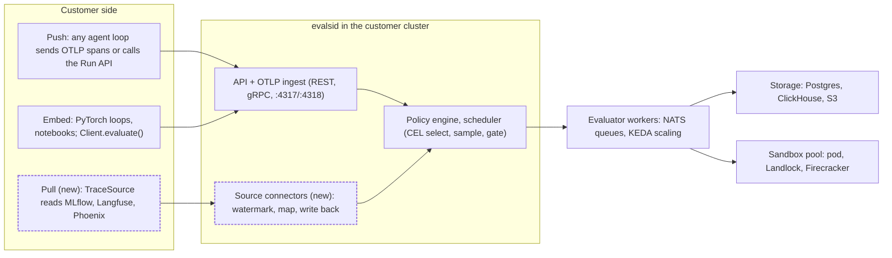
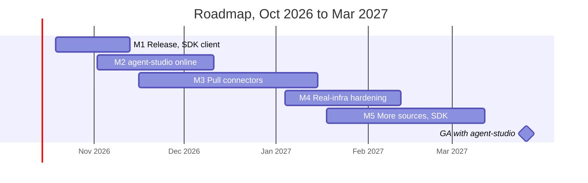

# Evals.si for Customer Kubernetes: Product Requirements

Status: draft · 2026-10-09 · Abhishek Ranjan

## Summary

Evals.si becomes an evaluation microservice that customers install in their own Kubernetes cluster and call on demand. It works with any agent loop and any OpenTelemetry trace store; agent-studio-standalone is the first integration, and the first cut supports the most popular frameworks and stores. Customers get any evaluation (LLM, RAG, agent, classic ML, RL) through three doors:

1. **Push:** applications send OpenTelemetry traces, or call the API with records, and get scores back.
2. **Pull:** Evals.si subscribes to the customer's existing trace store (first cut: MLflow, Langfuse, Phoenix), evaluates new data as it lands, and writes scores back.
3. **Embed:** a Python SDK call inside a script, notebook or PyTorch training loop, running in-process or against the cluster service.

About 70% of this already ships (Helm charts, operator, OTLP ingest, online policies, run API, in-process SDK, RL rewards). This PRD covers the remaining 30%. Those are pull connectors, an SDK log call, a remote `evaluate()` client, an agent-studio integration package and a production release. The target is agent-studio-standalone evaluating every deployed workflow in its own cluster by **end of Q1 2027**.

## Scope: any agent loop, any trace store

Evals.si is framework-neutral: anything that emits OpenTelemetry spans, or calls the API or SDK, can be evaluated. The first cut adds tested mapping profiles for five popular agent frameworks and pull connectors for three popular trace stores. Everything else still works through the generic paths.

**Agent loops.** Any loop is supported through one of three generic paths: OTel GenAI semantic conventions, OpenInference or OpenLLMetry spans, or `evalsi.log()` and the Run API for loops with no tracing. A mapping profile turns a framework's spans into an Evals.si trajectory (steps, tool calls, model calls, final output). Profiles are tested against fixtures captured from each framework.

| Agent framework | First cut | Instrumentation |
| --- | --- | --- |
| LangGraph / LangChain | Yes | OpenInference, LangSmith OTel export |
| OpenAI Agents SDK | Yes | OpenInference, native tracing processor |
| CrewAI (and agent-studio-standalone) | Yes | MLflow autolog, OpenInference, OpenLLMetry |
| Claude Agent SDK | Yes | OTel GenAI conventions |
| LlamaIndex | Yes | OpenInference |
| AutoGen, Pydantic AI, Google ADK, Semantic Kernel | Later (generic path works today) | OTel GenAI conventions |
| Custom loop, PyTorch or RL rollout | Generic path | `evalsi.log()`, Run API, in-process SDK |

**Trace stores.** OTLP is a push protocol, so any OTLP-compatible store (Tempo, Jaeger, Datadog, Honeycomb, Elastic) is covered by teeing the customer's OTel Collector to evalsid; no connector is needed. Pull connectors are for stores that keep LLM traces behind their own API, where customers also want scores written back into the UI they already use.

| Trace store | First cut (pull and write-back) | Write-back as |
| --- | --- | --- |
| MLflow Tracing (OSS 3.x, Databricks, SageMaker, Azure ML) | Yes | MLflow assessments |
| Langfuse | Yes | Langfuse scores |
| Arize Phoenix | Yes | Phoenix span annotations |
| LangSmith, ClickHouse, Tempo/Jaeger query | Later | Feedback, table rows, none |
| Any OTLP backend | Tee from collector (works today) | OTel `gen_ai.evaluation.result` events |
| Kafka, Kinesis, Pub/Sub, S3 drops | Later | Not applicable |

## Current state

The Kubernetes form factor and the push and embed doors exist today; the pull door and the release do not. Status is as of commit `d464381` on `main`.

| Capability | Status | Where it lives |
| --- | --- | --- |
| Helm install (`evalsi`, `evalsi-crds`, `evalsi-sandboxd`), namespace-only mode, air-gapped bundle | Built, tested on kind in CI | `deploy/helm/`, `deploy/airgap/` |
| Operator with `EvalRun`, `OnlineEvalPolicy`, `Evaluator`, `SandboxClass` | Built | `operator/` |
| gRPC, HTTP/JSON and REST API; durable, resumable runs | Built | `internal/server/`, `internal/runs/` |
| OTLP trace ingest, online policies (CEL select, sampling, cascades, alerts) | Built | `internal/ingest/`, `internal/watch/` |
| evalsi-collector (OTel Collector distribution with redaction) | Built | `deploy/collector/` |
| Score write-back to MLflow, Langfuse, Phoenix, OTel | Built | `internal/sinks/` |
| Evaluator packs (core, judge, text, RAG, safety, agent, code, RL, fine-tune, classic ML, monitoring) and framework adapters | Built | `python/evalsi/src/evalsi/packs/`, `python/adapters/` |
| Agent runs in sandboxes (Firecracker, bubblewrap, Landlock, hardened pod) | Built; Firecracker only with a stand-in | `internal/sandbox/` |
| In-process `evalsi.evaluate()`, RL rewards (TRL, verl, OpenRLHF), checkpoint evaluation | Built | `python/evalsi/src/evalsi/` |
| OIDC, API keys, project RBAC, CEL rules, audit log | Built | `internal/auth/`, `internal/authz/` |
| Pull connectors for trace stores (MLflow, Langfuse, Phoenix, LangSmith, Tempo, ClickHouse) | Designed, not built | DESIGN.md "Path C" |
| Log and stream sources (Kafka, CloudWatch, Loki, S3 drops) | Not designed | none |
| `evalsi.log()` SDK call | Designed, not built | DESIGN.md "Path E" |
| Remote `Client.evaluate()` helper | Missing (raw `client.call` only) | `python/evalsi/src/evalsi/client.py` |
| Release tag, signed images, published charts | Not done | `.github/workflows/release.yml` |

## Priority customer: agent-studio-standalone

agent-studio-standalone is the first application integrated, and every requirement below is ranked by what it needs. It is our own agent-builder application, run on Kubernetes outside any managed platform. Builders design multi-agent workflows (agents, tasks, tools, MCP servers, LLM configs), test them, and deploy each workflow as its own service.

**Confirmed facts** (from the product owner, 9 October 2026):

- Workflows trace to MLflow Tracing (open-source MLflow 3.x, Databricks, or a cloud-managed MLflow).
- Each install is single-tenant: one studio per customer, so one Evals.si project per studio install.
- Evals.si ships as its own independent Helm chart, installed beside the studio the way agent-sandbox is, with an integration guide. It is not a subchart.
- Agents built in the studio are evaluated however they can be called: HTTP or gRPC, A2A, or in-process Python once workflows are published as PyPI packages.
- There is no default judge model; the customer configures one.
- Still assumed: the cluster may be air-gapped and run under strict namespace-scoped RBAC.

**What it needs from Evals.si:**

| # | Need | Door | Priority |
| --- | --- | --- | --- |
| A1 | Score every production workflow execution online (task success, tool-call accuracy, loop detection, cost, safety) without code changes in the workflows | Push (OTLP tee) | P0 |
| A2 | Evaluate a workflow on a test set from the studio's "Test" screen before deploying, and block deploy on a failed gate | Push (Run API) | P0 |
| A3 | Show scores inside the studio UI, per workflow and per execution, linked to the trace | API + write-back | P0 |
| A4 | Read traces already stored in its MLflow tracking server, including history from before Evals.si was installed | Pull | P1 |
| A5 | Turn failing production executions into regression datasets, and replay a new workflow version against them | Push + Run API | P1 |
| A6 | Inline guardrails on tool calls and model calls, in audit mode first | Guardrails | P2 |
| A7 | Install Evals.si from its own chart beside agent-studio-standalone, with an integration guide | Deploy | P0 |

## Reference demo: DeepSeek Harness as the studio

Until agent-studio-standalone is available for testing, [DeepSeek Harness](https://github.com/deepseek-ai/deepseek-harness) (`dsh`, MIT, developer preview) stands in as the studio. Evals.si evaluates its coding agent in both standalone and Kubernetes mode, and this demo is the basis for the docs and the integration guide. dsh fits because it is an agent runtime like the studio: plugins for models, tools and sandboxes, a web UI, and automation entry points.

**What dsh offers that the demo uses** (checked against its `docs/cli-help.md`, 9 October 2026):

| dsh entry point | What it does | Evals.si use |
| --- | --- | --- |
| `dsh --profile headless --json "<task>"` | Runs one task and exits, writing newline-delimited run events to stdout | Agent under test, run as a CLI agent inside each task's sandbox; events become the trajectory |
| `dsh --profile acp` | Serves Agent Client Protocol over stdio | Optional second connector (ACP), reusable for other ACP agents |
| `dsh --profile sdk` / Python SDK | JSON-RPC over stdio | In-process target from Python, like a PyPI-packaged studio workflow |
| `dsh web` | Web UI on port 3080 | Plays the studio UI in the Kubernetes demo |
| OpenAI-compatible providers | DeepSeek API by default, any compatible endpoint | Target model; the judge is configured separately |

dsh's OpenTelemetry plugin exports product analytics only, not session traces. Offline runs use the headless JSON events. Online scoring of live dsh sessions needs a small dsh plugin that exports session events as OTel GenAI spans (R6).

**Demo scenario.** A coding agent (dsh headless on a configurable model) gets a set of repository tasks: the existing `examples/agents/fix-calc` task, about 10 SWE-bench-style fixtures, and optionally a `swebench://` Verified subset. Each task runs in its own sandbox. A checker runs the task's tests on the end state, and evaluators score the result: `task-success` (pass@k, pass^k), `code-quality` on the diff, `policy-violations`, tool errors, loop detection, step budget and cost.

| ID | Requirement | Priority |
| --- | --- | --- |
| R1 | Agent image `evalsi-demo-dsh`: Node 22, dsh pinned to a commit, headless profile; model endpoint and key from environment | P0 |
| R2 | Event mapping profile: dsh `--json` run events to an Evals.si trajectory (steps, tool calls, model calls, final message), tested against recorded fixtures | P0 |
| R3 | Run spec `examples/demo/dsh-coding/run.yaml`, identical in standalone and Kubernetes mode | P0 |
| R4 | Standalone walkthrough: `evalsi run -f ...` embedded, then `--server` against `evalsid serve`, on the bubblewrap rung; report and `/ui/` | P0 |
| R5 | Kubernetes walkthrough on kind: `evalsi-crds`, `evalsi` and a sandbox pool from their own charts; `dsh web` Deployment as the studio; `kubectl apply` of the `EvalRun`; scores in `/ui/` and in MLflow through the sink | P0 |
| R6 | dsh tracing plugin that exports sessions as OTel GenAI spans, so an `OnlineEvalPolicy` scores live sessions | P1 |
| R7 | CI: the kind e2e job runs the demo against a deterministic mock model, so no API key is needed and results are reproducible | P0 |
| R8 | Integration guide `docs/guides/integrate-an-agent-studio.md`, written around dsh and covering the steps agent-studio-standalone will follow: install, connect traces, gate deploys, read scores | P0 |

The demo runs with a DeepSeek API key or any OpenAI-compatible endpoint. A judge is needed only for `code-quality`, and the customer configures it, as with every install.

dsh is a developer preview and warns of breaking changes, so the demo pins a dsh commit and the CI job (R7) catches drift when the pin moves.

## Goals, non-goals and success metrics

**Goals**

- G1. One `helm install` gives a customer a production-grade evaluation service in their own cluster, with no data leaving it.
- G2. Any evaluation the catalog supports can be run three ways (push, pull, embed) with identical scores.
- G3. agent-studio-standalone evaluates every deployed workflow online and gates every deploy offline.
- G4. Customers bring their own evaluators, judges, models, storage and identity.

**Non-goals**

- A hosted SaaS version of Evals.si (this PRD is self-hosted only).
- Replacing the customer's observability tool. Evals.si scores traces and writes back; it does not become their trace UI.
- Building a trace store for logs that have no LLM or agent content.
- Training or hosting judge models.

**Success metrics**

| Metric | Target | How measured |
| --- | --- | --- |
| Time from `helm install` to first score in agent-studio-standalone | under 30 minutes | Install runbook timed on a fresh kind and EKS cluster |
| Share of production workflow executions scored by at least one policy | 100% sampled at policy rate, no drops | `evalsi policy stats` vs. ingested trace count |
| Online scoring delay, trace end to score written back (cheap evaluators) | p95 under 30 s | evalsid `/metrics` histogram |
| Pull connector lag behind source | p95 under 2 min | Watermark age metric per source |
| Same records scored via push, pull and embed | Identical scores and intervals | Parity test in CI |
| Deploys in agent-studio-standalone that run a gate | 100% of production deploys | Studio deploy audit log |
| Scale | 10k traces/min ingest, 1k concurrent agent trials | Load test on a sized cluster |

## Personas and user journeys

| Persona | Wants | Touches |
| --- | --- | --- |
| Platform engineer | Install, upgrade, secure and scale Evals.si like any other cluster service | Helm values, CRDs, Grafana, RBAC |
| Workflow builder (agent-studio-standalone user) | Know whether a workflow is good before and after deploy, without writing eval code | Studio UI: test screen, scores tab, deploy gate |
| ML / AI engineer | Custom evaluators, judges and datasets; compare versions | Python SDK, CLI, run specs, `Evaluator` CRD |
| Researcher in a training loop | Scores and rewards inside a PyTorch loop, local or against the cluster | `evalsi.evaluate()`, `Client.evaluate()`, rewards |
| Data or SRE owner of an existing trace store | Scores on traces they already keep, written back where they look | `TraceSource` CRD, sinks |

**Journey 1: install beside agent-studio-standalone (A7).** The platform engineer installs the `evalsi` chart in its own namespace, as they would agent-sandbox, then follows the integration guide. A bootstrap job creates one project for the studio install and writes an ingest key and a runner key to Kubernetes Secrets. The studio's traces reach Evals.si either through a second OTLP exporter or through a `TraceSource` that pulls from its MLflow server.

1. Evals.si starts in namespace-only mode, with a Landlock or pod sandbox rung.
2. A default `OnlineEvalPolicy` per workflow scores task success, tool errors, loops, cost and PII.
3. The studio reads scores over the REST API and shows them per execution.

**Journey 2: gate a deploy (A2).** The builder clicks Deploy. The studio creates an `EvalRun` from the workflow's test set with gates (for example `task-success >= 0.8`). The run executes the workflow over HTTP, gRPC or A2A, or in-process from its PyPI package inside a sandbox. A failed gate blocks the deploy and links the report.

**Journey 3: production to regression (A5).** A policy promotes traces with `task-success < 1` into a dataset. The next deploy's gate run includes that dataset, and shadow replay compares the new version against recorded behavior.

**Journey 4: subscribe to an existing store (A4).** The SRE applies a `TraceSource` pointing at the studio's MLflow tracking server. Evals.si backfills 30 days, then polls every 30 s, scores with the same policies, and writes scores back as MLflow assessments.

**Journey 5: training loop.** A researcher calls `evalsi.Client(server).evaluate(records, ["llm-judge"])` every N steps, or uses `reward_funcs` from the cluster's Reward Service in GRPO.

## Requirements: deployment as a microservice

Evals.si must install, run and upgrade like any well-behaved cluster service; most of this exists and the gaps are packaging and release.

| ID | Requirement | Priority | Status |
| --- | --- | --- | --- |
| D1 | Install from a versioned OCI Helm chart (`oci://ghcr.io/.../evalsi`) with signed images (cosign keyless) and an SBOM | P0 | Gap: no release cut, images unsigned |
| D2 | Installs as an independent chart beside others (agent-studio-standalone, agent-sandbox): all names prefixed by release, every external dependency (Postgres, NATS, S3, ClickHouse) either bundled or pointed at an existing one | P0 | Partly: verify release-prefixed naming and `global` values |
| D3 | Namespace-only install with Pod Security `restricted`, no cluster-scoped objects | P0 | Built (`values-namespaced.yaml`) |
| D4 | Bootstrap job that creates projects, API keys and default policies from Helm values and writes keys to Secrets | P0 | Gap |
| D5 | Horizontal scale: API replicas, KEDA-scaled worker pools per evaluator image, sandbox pools | P0 | Built; KEDA untested on a live pool |
| D6 | Health, readiness, `/metrics`, Grafana dashboard, structured logs, OTel self-tracing | P0 | Built |
| D7 | Zero-downtime upgrade with forward-only DB migrations and a documented N-1 compatibility rule | P1 | Gap: policy not written |
| D8 | Air-gapped install from one bundle | P1 | Built |
| D9 | Mount Wasm and Python evaluator plugins from a volume or an init container | P1 | Gap (LEFTOVERS) |
| D10 | Backup and restore runbook for Postgres and object storage | P1 | Gap |
| D11 | Reference values for EKS, GKE, AKS, OpenShift and kind | P2 | Gap |

## Requirements: the three integration modes

All three modes feed the same evaluator catalog and policy engine, so a record gets the same score whichever door it came through.

### Push: customers send data to us

| ID | Requirement | Priority | Status |
| --- | --- | --- | --- |
| P1 | OTLP gRPC and HTTP ingest of GenAI, OpenInference and OpenLLMetry spans, project assigned from the ingest credential | P0 | Built |
| P2 | On-demand `Evaluate` and `EvaluateStream` for records sent in the request | P0 | Built |
| P3 | Run API: create, watch, cancel, resume, compare, with gates and budgets | P0 | Built |
| P4 | Webhook callback when a run or a scored trace finishes, signed with HMAC | P0 | Gap (only policy alerts have webhooks) |
| P5 | `evalsi.log(input, output, trace_id, metadata)` SDK call for apps without OTel, batched and async | P1 | Gap (DESIGN Path E) |
| P6 | Bulk upload: POST a JSONL or Parquet file, or reference an S3 object, as a dataset | P1 | Gap (datasets from S3 exist; the REST API has no upload endpoint) |
| P7 | Idempotency key on every write, so retries from customer pipelines never double-score | P1 | Gap |

### Pull: we subscribe to customer data sources

This is the largest new build. A new `TraceSource` resource (CRD and API) describes where to read, how to map records, which policies apply, and where to write scores back.

| ID | Requirement | Priority | Status |
| --- | --- | --- | --- |
| S1 | Connector interface: `List(since watermark) -> records + new watermark`, `WriteBack(scores)`; watermark stored per source and resumed after restart | P0 | Gap |
| S2 | Connectors for the first-cut trace stores: MLflow Tracing first (OSS 3.x, Databricks, SageMaker, Azure ML), then Langfuse and Arize Phoenix (LangSmith, ClickHouse, Tempo/Jaeger later) | P0 | Gap |
| S3 | Connectors for streams and logs: Kafka, AWS Kinesis, GCP Pub/Sub, S3/GCS prefix watcher; Loki and CloudWatch Logs via the evalsi-collector as recipes | P2 (after first cut) | Gap |
| S4 | Field mapping: CEL or JSONPath from the source record into Evals.si `Record` (input, output, reference, context, trajectory, metadata) | P0 | Gap |
| S5 | Backfill a time range, then tail; rate limit per source; at-least-once with dedup on source record ID | P0 | Gap |
| S6 | Pulled records reuse `OnlineEvalPolicy` (selectors, sampling, cascades, alerts, promotion) | P0 | Gap (wire into `internal/watch`) |
| S7 | Credentials for sources from Kubernetes Secrets or the existing per-project credential store, never in the CRD | P0 | Partly (credential store exists) |
| S8 | Status on the resource: watermark age, records/s, errors, last write-back | P0 | Gap |
| S9 | Scheduled pull runs (cron) that evaluate a query window as a batch run with a report | P1 | Gap |

### Embed: local scripts, notebooks and training loops

| ID | Requirement | Priority | Status |
| --- | --- | --- | --- |
| E1 | In-process `evalsi.evaluate()` and `aevaluate()` with every built-in pack, no server | P0 | Built |
| E2 | `Client.evaluate(records, evaluators, params)` and `Client.evaluate_stream()` that run on the cluster and return the same `EvaluationResult` type as E1 | P0 | Gap |
| E3 | Tensor-friendly batching: accept lists of dicts, pandas, or Hugging Face datasets; non-blocking futures so a training step never waits | P1 | Gap |
| E4 | RL rewards from the cluster Reward Service (TRL, verl, OpenRLHF) | P0 | Built |
| E5 | Checkpoint evaluation hooks for plain PyTorch and Lightning (not only Hugging Face `TrainerCallback`) | P1 | Gap (LEFTOVERS) |
| E6 | Log results from a local loop to the server as a run, so they show next to cluster runs | P1 | Partly |

## Architecture and API design

One new component, the source connector manager, sits beside the existing ingest path and feeds the same policy engine; everything else is new API surface on existing services.



Dashed boxes are new in this PRD.

Push and embed already reach the API; pull adds connectors that read customer stores and write scores back, then hand records to the same policies and workers.

### TraceSource resource (new)

Available as a CRD and as `POST /v1alpha1/sources`. The connector manager runs under the same lease as the policy engine, so one replica owns each source.

```yaml
apiVersion: evals.si/v1alpha1
kind: TraceSource
metadata: {name: studio-mlflow, namespace: evalsi}
spec:
  project: agent-studio
  connector: mlflow             # first cut: mlflow | langfuse | phoenix
  endpoint: http://mlflow.agent-studio:5000
  experimentIds: ["1"]
  credentialsSecretRef: {name: mlflow-token}
  backfill: {since: 720h}
  poll: {interval: 30s, maxRecordsPerSecond: 200}
  mapping:                      # CEL over the source trace
    input: 'trace.request'
    output: 'trace.response'
    metadata: {workflow: 'trace.tags["agent_studio.workflow_id"]'}
  policies: [studio-agent-quality]
  writeBack: {enabled: true, as: assessment}
status:
  watermark: "2026-10-09T12:00:00Z"
  lagSeconds: 41
  recordsPerSecond: 37
```

### New and changed API surface

| Surface | Change |
| --- | --- |
| `POST/GET/DELETE /v1alpha1/sources`, `POST /v1alpha1/sources/{name}:backfill`, `:pause`, `:resume` | New SourceService |
| `POST /v1alpha1/webhooks` | Subscribe to run finished, gate failed, trace scored, alert fired; HMAC-signed |
| `GET /v1alpha1/traces/{id}/scores`, `GET /v1alpha1/scores?project=&label=&since=` | Query scores per trace, workflow or label, for the studio UI |
| `evalsi.Client.evaluate()`, `evaluate_stream()`, `evaluate_async()` | Python wrappers over `EvaluationService` returning `EvaluationResult` |
| `evalsi.log(input=, output=, trace_id=, metadata=)` | Buffered client that sends OTLP to evalsid |
| Idempotency-Key header on every POST | Dedup retries |

### agent-studio-standalone integration contract

- **Helm:** Evals.si is an independent chart installed beside the studio, like agent-sandbox. The integration guide gives the values for project bootstrap, default policies and the customer's judge.
- **Tracing:** the studio already traces to MLflow. Either add evalsid as a second OTLP exporter, or apply a `TraceSource` with `connector: mlflow`. Label traces with `evalsi.label.workflow` and `evalsi.label.version`.
- **Deploy gate:** the studio creates an `EvalRun` whose target is the workflow over HTTP, gRPC or A2A, or its PyPI package run in-process in a sandbox, and waits on the run-finished webhook.
- **UI:** the studio reads `/v1alpha1/scores` and links each score to `/ui/` for the full report. Scores also appear in MLflow as assessments.

## Security, tenancy and operations

No customer data leaves the cluster unless the customer configures a judge or sink that sends it out. The existing identity and sandbox model covers most of this. New work is for pull connectors and the agent-studio tenant mapping.

- **Identity.** API keys, OIDC (including Kubernetes service-account tokens) and mTLS between components, as built. agent-studio-standalone authenticates with its pod's projected service-account token; no static key is required.
- **Tenancy.** agent-studio-standalone is single-tenant, so it uses one Evals.si project per studio install; other customers can use several projects. Ingest keys are bound to one project, so a workflow cannot inject traces into another tenant's policies. Per-project quotas cover runs, judge tokens and pull-source throughput (new).
- **Pull connector egress.** Each `TraceSource` declares its endpoint; a NetworkPolicy generated by the operator allows only that egress. Source credentials are read from Secrets at use time and never logged or returned by the API.
- **Data handling.** Redaction rules apply on ingest and on pull, before storage and before any judge call. Retention per project for traces, records and results, with a hard-delete API for data-subject requests.
- **Sandboxing.** Untrusted evaluator code and agent tasks run on the strongest available rung, failing closed. In the namespace-only agent-studio install, that is the pod or Landlock rung.
- **Audit.** Every API call, policy change and source change is in the audit log, with the principal and decision.
- **Operations.** SLOs: API availability 99.9%, p95 online score delay under 30 s, pull lag under 2 min. Alerts ship as PrometheusRules in the chart. Runbooks cover a stuck watermark, a judge outage (scores report errors, never zeros), NATS backlog, and DB failover.

## Milestones and phased rollout

agent-studio-standalone gets online scoring and deploy gates first (M2, mid-December), because they need no new connectors; pull connectors follow in M3 and GA lands on 26 March 2027. Dates assume two to three engineers and are proposals.



M1 and M2 overlap because M2 needs only the release and the client from M1, not all of it.

**Exit criteria per milestone**

1. **M1 Release, SDK client** (D1, D2, D4, E2, P4): signed `v0.1.0` chart and images published; `Client.evaluate()` returns scores identical to in-process; webhooks fire on run finish.
2. **M2 agent-studio online** (A1, A2, A3, A7): Evals.si installs from its own chart beside the studio by following the integration guide; every deployed workflow is scored by a default policy; a failed gate blocks a deploy in a demo cluster. The DeepSeek Harness demo (R1 to R5, R7, R8) runs in standalone and Kubernetes mode, and the integration guide is published.
3. **M3 Pull connectors** (S1, S2, S4 to S8): a `TraceSource` backfills 30 days from MLflow (OSS 3.x, Databricks, SageMaker, Azure ML), then from Langfuse and Phoenix, and tails with p95 lag under 2 min; scores appear in each store's own UI. Mapping profiles for the five first-cut agent frameworks pass their fixture tests.
4. **M4 Real-infra hardening** (D5, D7, D10): load test of 10k traces/min and 1k concurrent trials on EKS; KEDA, 3-node NATS and a Firecracker pool run live; upgrade from M1 to M4 with no downtime.
5. **M5 More sources, SDK** (S2 later stores, S3, P5, E3, E5): LangSmith and ClickHouse connectors, Kafka and S3 sources; `evalsi.log()`; PyTorch and Lightning checkpoint hooks.
6. **GA with agent-studio:** all P0 requirements met, runbooks and SLO alerts shipped, one external pilot running for 4 weeks.

## Risks and open questions

| Risk | Impact | Mitigation |
| --- | --- | --- |
| Source APIs (MLflow variants, Langfuse, Phoenix) change or rate-limit pulls | Pull lag, missed records | Version-pinned connectors with contract tests; back off on 429; prefer OTLP tee where the customer can |
| Judge cost grows with production traffic | Surprise bills | Cascades and sampling on by default; per-project token quotas; no default judge |
| Namespace-only installs get only the weakest sandbox rung | Code evaluators slower or unavailable | Pod rung by default; document Firecracker pool as an opt-in cluster add-on |
| Firecracker, KEDA and multi-node NATS untested on real infra | Incidents at first customer scale | Run them on a staging EKS cluster before GA (M4) |
| agent-studio's MLflow traces differ from the shapes the mapping profiles expect | Agent evaluators skip records | Mapping layer (S4) plus a fixture set captured from real studio traces |

**Open questions**

- [x] Trace backend: MLflow Tracing.
- [x] Tenancy: single tenant.
- [x] Workflow invocation: HTTP, gRPC, A2A, or in-process from PyPI.
- [x] Default judge: none; the customer configures one.
- [x] Packaging: an independent chart plus an integration guide.
- [ ] Access to the agent-studio-standalone repo for the real-cluster test and trace fixtures (planned for that test).
- [ ] Kafka and log sources: built-in connectors, or collector recipes only for v1?
